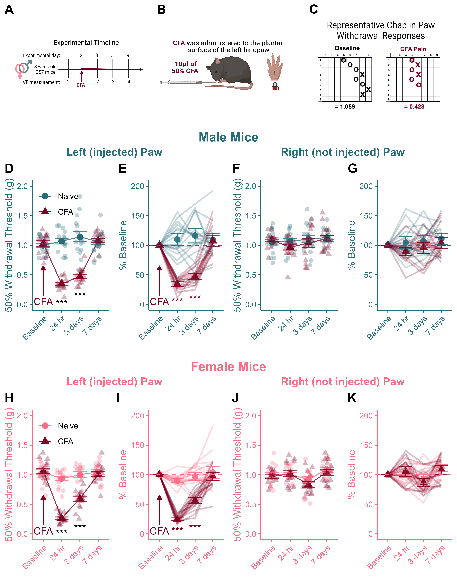

```{r, include=FALSE}
knitr::opts_chunk$set(message = FALSE, 
                      warning = FALSE,
                      echo = FALSE,
                      fig.align = 'center')
options(scipen = 999)
```

# Figure 3 - Recovery from CFA Injury {-}

``` {r, Load packages}
library(tidyverse) # For tidy text
library(reshape2) # For melting
library(ggpubr) # For making panels
library(png) # To call in .png images
library(rstatix) # for Stats
library(tinytable)
```


```{r, Get Data & Wrangle}
## Get Data & Wrangle

data <- read_csv("Data/CSV_4_R.csv")

data$CFA <- as.character(data$CFA)
data$CFA <- factor(data$CFA, levels=unique(data$CFA))

female_data <- subset(data[data$Sex == "Female", 1:11, ])
female_left <- subset(female_data[ ,1:4])
female_left$hr_24 <- female_data$hr_24.L
female_left$days_3 <- female_data$days_3.L
female_left$days_7 <- female_data$days_7.L
female_right <- subset(female_data[ ,1:3 ])
female_right$Baseline <- female_data$BL_R
female_right$hr_24 <- female_data$hr_24.R
female_right$days_3 <- female_data$days_3.R
female_right$days_7 <- female_data$days_7.R

male_data <- subset(data[data$Sex == "Male", 1:11, ])
male_left <- subset(male_data[ ,1:4])
male_left$hr_24 <- male_data$hr_24.L
male_left$days_3 <- male_data$days_3.L
male_left$days_7 <- male_data$days_7.L
male_right <- subset(male_data[ ,1:3])
male_right$Baseline <- male_data$BL_R
male_right$hr_24 <- male_data$hr_24.R
male_right$days_3 <- male_data$days_3.R
male_right$days_7 <- male_data$days_7.R
```


```{r, CFA_Recover_Lines Function Definition}
## CFA_Recover_Lines fun

CFA_Recover_Lines <- function(input,sex_colour){
  
colnames(input) <- c("ID", "Sex", "CFA", "Baseline", "24 hr", "3 days", "7 days")

a <- subset(input[-1])

means <- a %>% 
  group_by(`CFA`) %>% 
  summarise_at(vars(`Baseline`, `24 hr`, `3 days`, `7 days`), list(name=mean))
colnames(means) <- c("CFA", "Baseline", "24 hr", "3 days", "7 days")
means <- as.data.frame(means)
m_means <- melt(means)

sd <- a %>%
  group_by(`CFA`) %>%
  summarise_at(vars(`Baseline`, `24 hr`, `3 days`, `7 days`), list(name="sd"))

se <- sd / sqrt(15)
se$CFA <- sd$CFA
colnames(se) <- c("CFA", "Baseline", "24 hr", "3 days", "7 days")
se <- as.data.frame(se)
m_se <- melt(se)
m_se$mean <- m_means$value

a <- subset(a[-1])
a <- as.data.frame(a)
m_a <- melt(a)

b <- ggplot()+
  geom_line(data=m_means, aes(x=variable, y=value, group=CFA, colour=CFA), alpha=0.8)+
    scale_colour_manual(values = c(sex_colour, "#800020"))+
  geom_point(data=m_means, aes(x=variable, y=value, colour=CFA, shape=CFA), size=3)+
    scale_colour_manual(values = c(sex_colour, "#800020"))+
  geom_jitter(data=m_a, aes(x=variable, y=value, group=CFA, colour=CFA, shape=CFA), width=0.25,height=0, size=2, alpha=0.3)+
    scale_colour_manual(values = c(sex_colour, "#800020"))+
  geom_errorbar(data=m_se, aes(x=variable, ymin=mean-value, ymax=mean+value, colour=CFA), width=0.75, alpha=0.8)+
    scale_fill_manual(values = c(sex_colour, "#800020"))+
  theme_classic()+
  scale_y_continuous(expand = c(0, 0), limits= c(0,NA))+
  theme(plot.title = element_text(hjust = 0.5))+
  theme(legend.position="none")+
  theme(axis.title.x=element_text(colour=sex_colour))+
  theme(axis.title.y=element_text(colour=sex_colour))+
  theme(axis.text.x=element_text(colour=sex_colour))+
  theme(axis.text.y=element_text(colour=sex_colour))+
  theme(axis.text.x=element_text(angle=45, hjust=1))+
  theme(axis.line = element_line(colour=sex_colour))+
  theme(axis.ticks = element_line(colour=sex_colour))+
  labs(y = "50% Withdrawal Threshold (g)",
       x = "",
       title= ""
       )+
   ylim(0,2)

return(b)
}
```


```{r, individuals_lines function definition}
## Individuals_lines fun

individuals_lines <- function(input,sex_colour){

  colnames(input) <- c("ID", "Sex", "CFA", "Baseline", "24 hr", "3 days", "7 days")
  a <- subset(input[-2])
  b <- as.data.frame(a)
  b$`24 hr` <- (b$`24 hr`/b$Baseline)*100
  b$`3 days` <- (b$`3 days`/b$Baseline)*100
  b$`7 days` <- (b$`7 days`/b$Baseline)*100
  b$Baseline <- 100
  c <- melt(b, id.vars = c("ID", "CFA"))

means <- b %>% 
  group_by(`CFA`) %>% 
  summarise_at(vars(`Baseline`, `24 hr`, `3 days`, `7 days`), list(name=mean))
colnames(means) <- c("CFA", "Baseline", "24 hr", "3 days", "7 days")
means <- as.data.frame(means)
m_means <- melt(means)
  
sd <- b %>%
  group_by(`CFA`) %>%
  summarise_at(vars(`Baseline`, `24 hr`, `3 days`, `7 days`), list(name="sd"))

se <- sd / sqrt(7)
se$CFA <- sd$CFA
colnames(se) <- c("CFA", "Baseline", "24 hr", "3 days", "7 days")
se <- as.data.frame(se)
se$CFA <- sd$CFA
m_se <- melt(se)
m_se$mean <- m_means$value  
  
    
d <- ggplot(data=c, aes(x=variable, y=value, colour=CFA))+
  geom_line(data=c, group=c$ID, size=.8, alpha=0.25)+
  scale_colour_manual(values = c(sex_colour, "#800020"))+
  geom_point(data=m_se, aes(x=variable, y=mean, shape = CFA), size = 3, alpha=0.9)+
  geom_errorbar(data=m_se, aes(x=variable, ymin=mean-value, ymax=mean+value), alpha =0.9, width=0.75)+
  theme_classic()+
  theme(plot.title = element_text(hjust = 0.5))+
  theme(legend.position="left")+
  theme(axis.title.x=element_text(colour=sex_colour))+
  theme(axis.title.y=element_text(colour=sex_colour))+
  theme(axis.text.x=element_text(colour=sex_colour))+
  theme(axis.text.y=element_text(colour=sex_colour))+
  theme(axis.text.x=element_text(angle=45, hjust=1))+
  theme(axis.line = element_line(colour=sex_colour))+
  theme(axis.ticks = element_line(colour=sex_colour))+
  theme(legend.position = "none")+
  geom_hline(yintercept=100, linetype="dashed", colour=sex_colour)+
  labs(x = " ",
       y = "% Baseline",
       title = "")+
  ylim(0,200)

return(d)
}
```


```{r, warning=FALSE,message=FALSE}
## Generate charts

a <- CFA_Recover_Lines(female_left, "#FC6C85")
b <- CFA_Recover_Lines(female_right, "#FC6C85")
c <- CFA_Recover_Lines(male_left, "#256D7B")
d <- CFA_Recover_Lines(male_right, "#256D7B")

e <- individuals_lines(female_left, "#FC6C85")
f <- individuals_lines(female_right, "#FC6C85")
g <- individuals_lines(male_left, "#256D7B")
h <- individuals_lines(male_right, "#256D7B")
```


```{r, cartoons}

## Build the panel: 

## Call in cartoons

timeline <- readPNG("cartoons/fig.1_timeline.png")
mouse <- readPNG("cartoons/fig.1_mouse.png")
VF <- readPNG("cartoons/fig.1_VF.png")

AA <- ggplot()+
  background_image(timeline)+
  coord_equal(ratio=0.4)+
  theme(panel.background = element_rect(fill="#FFFFFF",colour="#FFFFFF"))+
  theme(plot.background = element_rect(fill = "#FFFFFF", colour="#FFFFFF"))
AB <- ggplot() +
  background_image(mouse)+
  coord_equal(ratio=0.4)+
  theme(panel.background = element_rect(fill="#FFFFFF",colour="#FFFFFF"))+
  theme(plot.background = element_rect(fill = "#FFFFFF", colour="#FFFFFF"))
AC <- ggplot() +
  background_image(VF)+
  coord_equal(ratio=0.75)+
  theme(panel.background = element_rect(fill="#FFFFFF",colour="#FFFFFF"))+
  theme(plot.background = element_rect(fill = "#FFFFFF", colour="#FFFFFF"))

cartoons <- ggarrange(AA,AB,AC,
                      nrow=1,ncol=3,
                      labels = c("A","B","C"))
```


```{r,customize graphs}
## Add significance indicators to left paw graphs.

C <- c +
  annotate("segment",x=1,y=.15,xend=1,yend= .65,colour="#800020",arrow=arrow(type="closed", length=unit(0.06,"npc")))+
  annotate("text", x=1,y=.05,label="CFA", colour="#800020")+
  annotate("text",x=c(2,3),y=c(0.01,0.15),label=c("***"),size=4)+
  theme(legend.justification = c(0,0.8),legend.position=c(0,1))+
  theme(legend.background=element_rect(fill="transparent"))+
  labs(color=" ",
       shape=" ")
 
G <- g + 
  annotate("segment",x=1,y=15,xend=1,yend= 65,colour="#800020",arrow=arrow(type="closed", length=unit(0.06,"npc")))+
  annotate("text", x=1,y=5,label="CFA", colour="#800020")+
  annotate("text",x=c(2,3),y=c(5,10),label=c("***"),size=4, colour="#800020")

A <- a +
  annotate("segment",x=1,y=.15,xend=1,yend= .65,colour="#800020",arrow=arrow(type="closed", length=unit(0.06,"npc")))+
  annotate("text", x=1,y=.05,label="CFA", colour="#800020")+
  theme(legend.justification = c(0,0.8),legend.position=c(0,1))+
  theme(legend.background=element_rect(fill="transparent"))+
  labs(color=" ",
       shape=" ")+
    annotate("text",x=c(2,3),y=c(0.01,0.1),label=c("***"),size=4)

E <- e + 
  annotate("segment",x=1,y=15,xend=1,yend= 65,colour="#800020",arrow=arrow(type="closed", length=unit(0.06,"npc")))+
  annotate("text", x=1,y=5,label="CFA", colour="#800020")+
    annotate("text",x=c(2,3),y=c(5,10),label=c("***"),size=4, colour="#800020")
```

```{r, arrange panel}
## Arrange pieces of the Fig.3 Panel

M_L <- ggarrange(C,G,
                 nrow=1,ncol=2,
                 labels=c("D","E"))
M_L <- annotate_figure(M_L, top = text_grob("Left (injected) Paw", color="#256D7B",face="bold",size="12"))

M_R <- ggarrange(d,h,
                 nrow=1,ncol=2,
                 labels=c("F","G"))
M_R <- annotate_figure(M_R, top = text_grob("Right (not injected) Paw", color="#256D7B",face="bold",size="12"))


F_L <- ggarrange(A,E,
                 nrow=1,ncol=2,
                 labels=c("H","I"))
F_L <- annotate_figure(F_L, top = text_grob("Left (injected) Paw", color="#FC6C85",face="bold",size="12"))

F_R <- ggarrange(b,f,
                 nrow=1,ncol=2,
                 labels=c("J","K"))
F_R <- annotate_figure(F_R, top = text_grob("Right (not injected) Paw", color="#FC6C85",face="bold",size="12"))

male <- ggarrange(M_L,M_R,
                  ncol=2,nrow=1)
male <- annotate_figure(male, top = text_grob("Male Mice", color="#256D7B", face="bold",size="14"))

female <- ggarrange(F_L,F_R,
                     ncol=2,nrow=1)
female <- annotate_figure(female, top = text_grob("Female Mice", color = "#FC6C85", face="bold",size="14"))

panel <- ggarrange(male,female,
                   ncol=1,nrow=2,
                   heights = c(3,3))

final_panel <- ggarrange(cartoons,panel,
                         nrow=2,ncol=1,
                         heights = c(2.25,8))
```

```{r}
ggsave(filename="Figs/3_VF_CFA_Recovery.png",final_panel, height=9,width=7,dpi=700,bg="white") 

# ggsave(filename="Figs/tiffs/3_VF_CFA_Recovery.tiff",final_panel,height=9,width=7,dpi=700,bg="white")
```

## Published Image {-}

```{r}

```

**Figure 3.** *CFA injection produces mechanical hypersensitivity that resolves within 7 days in male and female mice.* (A) Timeline of experimental testing. (B) Pain model to induce sensitization. (C) Representative images of Chaplan up-down von Frey measurements after CFA injection. CFA administration produces robust hypersensitivity at the site of injection that persists for at least 3 days and resolves within one week in both male (D, E) and female (H, I) mice. There were no changes in sensitivity of the contralateral (non-injected; right) hind paw during inflammatory pain and recovery from CFA injury in either males (F, G) or females (J, K). Data expressed as mean +/- SEM. $***$ Indicates between-group difference where *p* < 0.001 and # indicates a within-subject difference from baseline where *p* < 0.05.

## Statistical Analyses {-}
```{r, echo= TRUE}
# Select the left paws
left_paws <- rbind(female_left,male_left)

# Switch to long form
a <- left_paws %>% 
  melt(id.vars=c("ID","Sex","CFA"))

# Run RM anova on the 4 days of VF measuremenets
b <- anova_test(data=a, dv=value,wid=ID,between=c(CFA,Sex),within=variable,effect.size="pes")
knitr::kable(get_anova_table(b))
```

- Significant main effects of CFA and timepoint. 

- Significant interaction between CFA and timepoint (F(3,180) = 91.67, p < 0.001)

- Significant 3-way interaction between Sex, CFA and timepoint (F(3,180) = 3.57, p = 0.015)

```{r,echo = TRUE}
# Run two way ANOVAs for males and females separately: 

## Males
res <- a %>%
  filter(Sex == "Male") %>%
  anova_test(dv=value,wid=ID,between=CFA,within=variable,effect.size = "pes")
```

There is a significant interaction between CFA treatment and time point (F(3,90) = 47.44, p < 0.001)

```{r,echo=TRUE}
### Follow up for males: 
res <- a %>% 
  filter(Sex == "Male") %>%
  group_by(variable) %>%
  pairwise_t_test(value~CFA,p.adjust.method = "bonferroni")

tt(res)
```

- CFA-injected males have lower paw withdrawal thresholds than naive males 24 hours and 3 days post CFA administration (both p < 0.001). 

- There is no difference between the groups at baseline or 7 days post injection. 

```{r,echo=TRUE}
## Females 
a %>% 
  filter(Sex == "Female") %>%
  anova_test(dv=value,wid=ID,between=CFA,within=variable,effect.size="pes")
```

- CFA-injected female mice also have lower paw withdrawal thresholds than naive males 24 hours and 3 days post CFA administration (both p < 0.001). 

```{r}
### Follow up for Female: 
res <- a %>% 
  filter(Sex == "Female") %>%
  group_by(variable) %>%
  pairwise_t_test(value~CFA,p.adjust.method = "bonferroni")

tt(res)
```

- CFA-injected males have lower paw withdrawal thresholds than naive males 24 hours and 3 days post CFA administration (both p < 0.001). 

- There is no difference between the groups at baseline or 7 days post injection. 

```{r,echo = TRUE}
# Follow up the significant 3-way interaction using piarwise comparisons by invstigating the effect of Sex on each day of testing split by CFA
res <- a %>%
  group_by(CFA,variable) %>%
  pairwise_t_test(value~Sex,p.adjust.method = "bonferroni")

tt(res)
```

- There was a sex difference in CFA-induced hypersensitivity both 24 hours (p = 0.017) and 3 days (p = 0.0288) post injection. 

- Female mice exhibited MORE sensitivity than males at the 24hour time point, and LESS sensitivity than males 3-days after CFA. 

```{r, echo=TRUE}
## Effect of day within each of the 4 groups (i.e., the same thing as the % BL stat..)
### Only read & interpret measurements relative to BASELINE

b <- a %>% group_by(CFA,Sex) %>% 
  pairwise_t_test(value~variable,p.adjust.method = "bonferroni")
tt(b)
```

- CFA administration produced a robust hypersensitivity in the injected paw.

- There was no evidence of sensitivity in the contralateral (non-injured) paw. 

- CFA-induced sensitivity resolved within one week post injection. 


