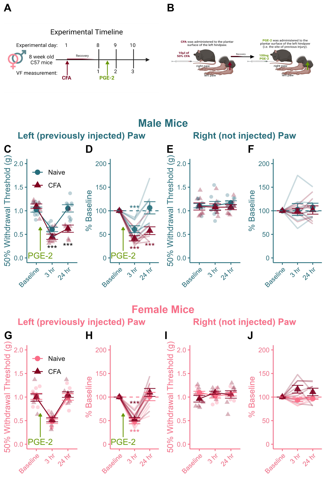

# Figure 4 - Recovery From PGE-2 Injection {-}

``` {r, include = FALSE}
library(ggplot2) # For pretty Graphs 
library(tidyverse) # For tidy code
library(reshape2) # For melt
library(ggpubr) # For aligning panels
library(png) # To read in .png images\
library(rstatix)
library(tinytable)

knitr::opts_chunk$set(message = FALSE, 
                      warning = FALSE,
                      echo = FALSE,
                      fig.align = 'center')
options(scipen = 999)
```


```{r}
# Get Data

data <- read.csv("Data/PGE2_CSV_R.csv", stringsAsFactors = TRUE) # Call in data

data$CFA <- as.character(data$CFA) # Reordering key. Default is alphabetical CFA > Naive... I want them reordered. 
data$CFA <- factor(data$CFA, levels=unique(data$CFA))
```


```{r}
# Wrangle

Female_data <- as_tibble(data[1:32, ]) # Subset data to include only the females 
L_Female <- subset(Female_data[ ,1:5]) # Select the columns that contain ID info to start 
L_Female$hr_3 <- Female_data$PG_3_L # Attach the other "left" columns
L_Female$hr_24 <- Female_data$PG_24_L
colnames(L_Female) <- c("ID", "Sex", "CFA", "PGE2", "Baseline", "3 hr", "24 hr") # Rename columns for consistency. 

R_Female <- subset(Female_data[ ,1:4]) # Repeat process for right paw. 
R_Female$Baseline <- Female_data$Right_4
R_Female$hr_3 <- Female_data$PG_3_R
R_Female$hr_24 <- Female_data$PG_24_R
colnames(R_Female) <- c("ID", "Sex", "CFA", "PGE2", "Baseline", "3 hr", "24 hr")

Male_data <- as_tibble(data[33:64, ]) # Repeat code for males. 
L_Male <- subset(Male_data[ ,1:5])
L_Male$hr_3 <- Male_data$PG_3_L
L_Male$hr_24 <- Male_data$PG_24_L
colnames(L_Male) <- c("ID", "Sex", "CFA", "PGE2", "Baseline", "3 hr", "24 hr")

R_Male <- subset(Male_data[ ,1:4])
R_Male$Baseline <- Male_data$Right_4
R_Male$hr_3 <- Male_data$PG_3_R
R_Male$hr_24 <- Male_data$PG_24_R
colnames(R_Male) <- c("ID", "Sex", "CFA", "PGE2", "Baseline", "3 hr", "24 hr")
```

```{r, }
# Define functions

PGE2_Lines <- function(input, fname, title, sex_colour){

a <- subset(input[-1]) 

b <- subset(a, a$PGE2 == "PGE2")

means <- b %>% 
  group_by(`CFA`) %>% 
  summarise_at(vars(`Baseline`, `3 hr`, `24 hr`), list(name=mean))
colnames(means) <- c("CFA", "Baseline", "3 hr", "24 hr")
means <- as.data.frame(means)
m_means <- melt(means)

sd <- b %>%
  group_by(`CFA`) %>%
  summarise_at(vars(`Baseline`, `3 hr`, `24 hr`), list(name="sd"))

se <- sd / sqrt(7)
se$CFA <- sd$CFA
colnames(se) <- c("CFA", "Baseline", "3 hr", "24 hr")
se <- as.data.frame(se)
se$CFA <- sd$CFA
m_se <- melt(se)
m_se$mean <- m_means$value

c <- subset(a, a$PGE2 == "PGE2")
c <- subset(c[-1])
c <- subset(c[-2])
c <- as.data.frame(c)
m_c <- melt(c)

d <- ggplot()+
  geom_line(data=m_means, aes(x=variable, y=value, group=CFA, colour=CFA))+
  geom_point(data=m_means, aes(x=variable, y=value, colour=CFA, shape=CFA), size=3)+
  geom_jitter(data=m_c, aes(x=variable, y=value, group=CFA, colour=CFA, shape=CFA), width=0.25,height=0, size=2, alpha=0.3)+
  geom_errorbar(data=m_se, aes(x=variable, ymin=mean-value, ymax=mean+value, colour=CFA), width=0.75, alpha=0.8)+
  scale_colour_manual(values = c(sex_colour, "#800020"))+
  scale_fill_manual(values = c(sex_colour, "#800020"))+
  theme_classic()+
  theme(legend.position="none")+
  theme(axis.title.x=element_text(colour=sex_colour))+
  theme(axis.title.y=element_text(colour=sex_colour))+
  theme(axis.text.x=element_text(colour=sex_colour))+
  theme(axis.text.y=element_text(colour=sex_colour))+
  theme(axis.text.x=element_text(angle=45, hjust=1))+
  theme(axis.line = element_line(colour=sex_colour))+
  theme(axis.ticks = element_line(colour=sex_colour))+
  labs(y = "50% Withdrawal Threshold (g)",
       x = "",
       title = ""
       )+
   ylim(0,2)

return(d)
}
```


```{r, }
#### Individuals Lines plus means function

individuals_lines_means <- function(input, fname, title,sex_colour){
  colnames(input) <- c("ID", "Sex", "CFA", "PGE2", "Baseline", "3 hr", "24 hr")
  a <- subset(input[-2])
  b <- as.data.frame(a)
  b$`3 hr` <- (b$`3 hr`/b$Baseline)*100
  b$`24 hr` <- (b$`24 hr`/b$Baseline)*100
  b$Baseline <- 100
  b <- subset(b, b$PGE2 == "PGE2")
  b <- subset(b[-3])
  c <- melt(b, id.vars = c("ID", "CFA"))
  
means <- b %>% 
  group_by(`CFA`) %>% 
  summarise_at(vars(`Baseline`, `3 hr`, `24 hr`), list(name=mean))
colnames(means) <- c("CFA", "Baseline", "3 hr", "24 hr")
means <- as.data.frame(means)
m_means <- melt(means)

sd <- b %>%
  group_by(`CFA`) %>%
  summarise_at(vars(`Baseline`, `3 hr`, `24 hr`), list(name="sd"))

se <- sd / sqrt(7)
se$CFA <- sd$CFA
colnames(se) <- c("CFA", "Baseline", "3 hr", "24 hr")
se <- as.data.frame(se)
se$CFA <- sd$CFA
m_se <- melt(se)
m_se$mean <- m_means$value  
  
    
d <- ggplot(data=c, aes(x=variable, y=value, colour=CFA))+
  geom_line(data=c, group=c$ID, size=.8, alpha=0.25)+
  scale_colour_manual(values = c(sex_colour, "#800020"))+
  geom_point(data=m_se, aes(x=variable, y=mean, shape = CFA), size = 3, alpha=0.9)+
  geom_errorbar(data=m_se, aes(x=variable, ymin=mean-value, ymax=mean+value), alpha =0.9, width=0.75)+
  theme_classic()+
  theme(legend.position="none")+
  theme(axis.title.x=element_text(colour=sex_colour))+
  theme(axis.title.y=element_text(colour=sex_colour))+
  theme(axis.text.x=element_text(colour=sex_colour))+
  theme(axis.text.y=element_text(colour=sex_colour))+
  theme(axis.text.x=element_text(angle=45, hjust=1))+
  theme(axis.line = element_line(colour=sex_colour))+
  theme(axis.ticks = element_line(colour=sex_colour))+
  geom_hline(yintercept=100, linetype="dashed", colour=sex_colour)+
  labs(x = " ",
       y = "% Baseline",
       title = "")+
  ylim(0,200)

return(d)
}
```

```{r, }
# Generate charts using the funs defined above

a <- PGE2_Lines(L_Female, "L.F", "Female Left", "#FC6C85")
b <- PGE2_Lines(R_Female, "R.F", "Female Right","#FC6C85")
c <- PGE2_Lines(L_Male, "L.M", "Male Left", "#256D7B")
d <- PGE2_Lines(R_Male, "R.M", "Male Right", "#256D7B")

e <- individuals_lines_means(L_Female, "L.F", "Female Left","#FC6C85")
f <- individuals_lines_means(R_Female, "R.F", "Female Right","#FC6C85")
g <- individuals_lines_means(L_Male, "L.M", "Male Left", "#256D7B")
h <- individuals_lines_means(R_Male, "R.M", "Male Right", "#256D7B")
```

```{r,warning=FALSE}
## Customize Left paw graphs

C <- c +
  annotate("segment",x=1.25,y=.15,xend=1.25,yend= .65,colour="#669900",arrow=arrow(type="closed", length=unit(0.06,"npc")))+
  annotate("text", x=1.25,y=.05,label="PGE-2", colour="#669900")+
  annotate("text",x=c(2,3),y=c(0.2,0.25),label=c("***","***"),size=4)+
  theme(legend.justification = c(0,0.8),legend.position=c(0,1))+
  theme(legend.background = element_rect(fill="transparent"))+
  labs(color=" ",
       shape=" ")

G <- g + 
  annotate("segment",x=1.25,y=15,xend=1.25,yend= 65,colour="#669900",arrow=arrow(type="closed", length=unit(0.06,"npc")))+
  annotate("text", x=1.25,y=5,label="PGE-2", colour="#669900")+
  annotate("text",x=c(2,3),y=c(18,25),label=c("***","***"),colour="#800020",size=4)+
  annotate("text",x=c(2),y=c(105),label="***",colour="#256D7B",size=4)

A <- a +
  annotate("segment",x=1.25,y=.15,xend=1.25,yend= .65,colour="#669900",arrow=arrow(type="closed", length=unit(0.06,"npc")))+
  annotate("text", x=1.25,y=.05,label="PGE-2", colour="#669900")+
  theme(legend.justification = c(0,0.8),legend.position=c(0,1))+
  theme(legend.background = element_rect(fill="transparent"))+
  labs(color=" ",
       shape=" ")

E <- e + 
  annotate("segment",x=1.25,y=15,xend=1.25,yend = 65,colour="#669900",arrow=arrow(type="closed", length=unit(0.06,"npc")))+
  annotate("text", x=1.25,y=5,label="PGE-2", colour="#669900")+
  annotate("text",x=c(2,3),y=c(25),label=c("***",""),colour="#FC6C85",size=4)+
  annotate("text",x=c(2),y=c(85),label="***",colour="#800020",size=4)
```


```{r}
# Call in cartoons 

timeline <- readPNG("Cartoons/Fig.2_timeline.png")
mouse <- readPNG("Cartoons/fig.2_mouse.png")

AA <- ggplot()+
  background_image(timeline)+
  coord_equal(ratio=0.45)
AB <- ggplot()+
  background_image(mouse)+
  coord_equal(ratio=0.3)
```


```{r, }
# Arrange Panels 

cartoons <- ggarrange(AA,AB,
                      nrow=1,ncol=2,
                      labels=c("A","B"))

M_L <- ggarrange(C,G,
                 nrow=1,ncol=2,
                 labels=c("C","D"))
M_L <- annotate_figure(M_L, top = text_grob("Left (previously injected) Paw", color="#256D7B",face="bold",size="12"))

M_R <- ggarrange(d,h,
                 nrow=1,ncol=2,
                 labels=c("E","F"))
M_R <- annotate_figure(M_R, top = text_grob("Right (not injected) Paw", color="#256D7B",face="bold",size="12"))


F_L <- ggarrange(A,E,
                 nrow=1,ncol=2,
                 labels=c("G","H"))
F_L <- annotate_figure(F_L, top = text_grob("Left (previously injected) Paw", color="#FC6C85",face="bold",size="12"))

F_R <- ggarrange(b,f,
                 nrow=1,ncol=2,
                 labels=c("I","J"))
F_R <- annotate_figure(F_R, top = text_grob("Right (not injected) Paw", color="#FC6C85",face="bold",size="12"))

male <- ggarrange(M_L,M_R,
                  ncol=2,nrow=1)
male <- annotate_figure(male, top = text_grob("Male Mice", color="#256D7B", face="bold",size="14"))

female <- ggarrange(F_L,F_R,
                     ncol=2,nrow=1)
female <- annotate_figure(female, top = text_grob("Female Mice", color = "#FC6C85", face="bold",size="14"))

panel <- ggarrange(male,female,
                   ncol=1,nrow=2,
                   heights = c(3,3))

final_panel <- ggarrange(cartoons,panel,
                         nrow=2,ncol=1,
                         heights = c(2.5,8))

# ggsave(filename="Figs/tiffs/4_CFA_PGE2.tiff",height=9,width=6,device='tiff',dpi=700,bg="white")

ggsave(filename="Figs/4_CFA_PGE2.png",final_panel,height=9,width=6,dpi=700,bg="white") 
```

## Published Image {-}

```{r}
## Call back the panel

```

**Figure 4.** *CFA-priming produced enhanced and prolonged mechanical sensitivity after PGE-2 injection in male mice only.* (A) Timeline of experimental testing. (B) PGE-2 was administered to the site of previous injury to test expression of pain sensitization. CFA-primed male mice exhibited enhanced (3hr) and prolonged (24hr) mechanical sensitivity after PGE-2 injection relative to naive mice injected with PGE-2 (C). naive males recovered their baseline paw withdrawal thresholds 24 hours after PGE-2, whereas CFA-primed males exhibited ongoing sensitivity (C,D). There was no difference in the magnitude of mechanical sensitivity induced by PGE-2 injection 3hrs post administration in female mice (G), and both CFA-primed and pin-naive mice recovered basal levels of mechanical sensitivity 24 hours post-administration (H). There were no decreases in paw sensitivity in the contralateral (never-injected) paw during pain & recovery from PGE-2 administration (E,F,I,J). Data expressed as mean +/- SEM. $***$ Indicates between-group difference where *p* < 0.001 and # indicates a within-subject difference from baseline where *p* <0.05.

## Statistics {-}
```{r,echo = TRUE}
# Select the left paws
left_paws <- rbind(L_Male,L_Female)

# Remove those that did not receive PGE2 and switch to long form
a <- left_paws %>%
  filter(PGE2 == "PGE2") %>%
  melt(id.vars=c("ID","CFA","Sex","PGE2"))

# Run 3-way ANOVA: Sex X CFA X Day of testing (VF)
b <- anova_test(data=a,dv=value,between=c(Sex,CFA),within=variable,wid=ID)
knitr::kable(get_anova_table(b))

# Run both sets of follow ups: 

## Effect of CFA on each day of testing split by sex
b <- a %>%
  group_by(Sex,variable) %>%
  pairwise_t_test(value~CFA)

tt(b)

## Effect of Sex on each day of testing split by CFA history
c <- a %>%
  group_by(CFA,variable) %>%
  pairwise_t_test(value~Sex)

tt(c)

## Effect of DAY within each group
d <- a %>%
  group_by(CFA,Sex) %>%
  pairwise_t_test(value~variable,p.adjust.method = "bonferroni")

tt(d)
```

