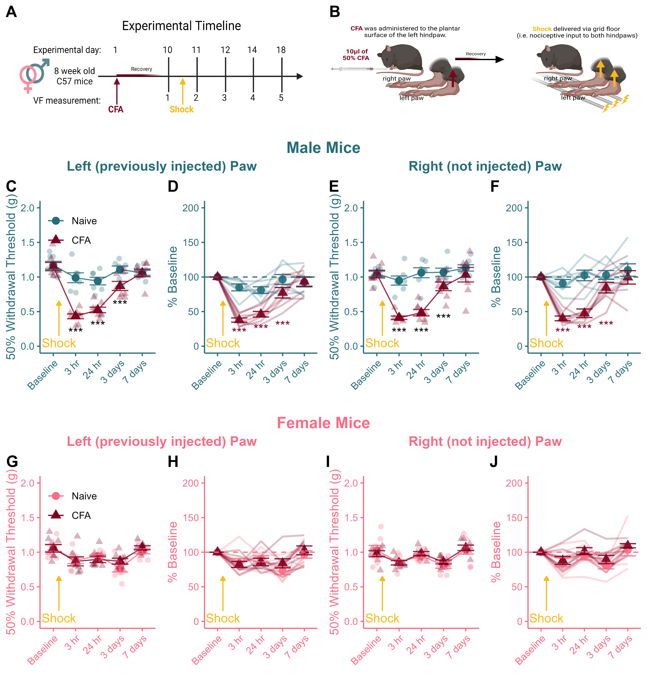

# Figure 5 - Recovery From Footshock {-}

``` {r, include = FALSE}
library(ggplot2) # For pretty Graphs 
library(tidyverse) # For tidy code
library(reshape2) # For melt
library(ggpubr) # For aligning panels
library(png) # To read in .png images\
library(rstatix)
library(tinytable)

knitr::opts_chunk$set(message = FALSE, 
                      warning = FALSE,
                      echo = FALSE,
                      fig.align = 'center')
options(scipen = 999)
```

```{r}
# Get data
Male_data <- read_csv("Data/FC_VF_CSV_R.csv")
Female_data <- read_csv("Data/Female_FC_VF_CSV_R.csv")
```

```{r}
# Reorder conditions

Male_data$CFA <- as.character(Male_data$CFA)
Male_data$CFA <- factor(Male_data$CFA, levels=unique(Male_data$CFA))

Female_data$CFA <- as.character(Female_data$CFA)
Female_data$CFA <- factor(Female_data$CFA, levels=unique(Female_data$CFA))
```

```{r}
# Splice n Dice

L_Female <- subset(Female_data[ ,1:3])
L_Female$hr_3 <- Female_data$`3hrs_L`
L_Female$hr_24 <- Female_data$`24hrs_L`
L_Female$days_3 <- Female_data$`3D_L`
L_Female$days_7 <- Female_data$`7D_L`
colnames(L_Female) <- c("ID", "CFA", "Baseline", "3 hr", "24 hr", "3 days", "7 days")

R_Female <- subset(Female_data[ ,1:2])
R_Female$Baseline <- Female_data$BL_R
R_Female$hr_3 <- Female_data$`3hrs_R`
R_Female$hr_24 <- Female_data$`24hrs_R`
R_Female$days_3 <- Female_data$`3D_R`
R_Female$days_7 <- Female_data$`7D_R`
colnames(R_Female) <- c("ID", "CFA", "Baseline", "3 hr", "24 hr", "3 days", "7 days")

L_Male <- subset(Male_data[ ,1:3])
L_Male$hr_3 <- Male_data$`3hrs_L`
L_Male$hr_24 <- Male_data$`24hrs_L`
L_Male$days_3 <- Male_data$`3D_L`
L_Male$days_7 <- Male_data$`7D_L`
colnames(L_Male) <- c("ID", "CFA", "Baseline", "3 hr", "24 hr", "3 days", "7 days")

R_Male <- subset(Male_data[ ,1:2])
R_Male$Baseline <- Male_data$BL_R
R_Male$hr_3 <- Male_data$`3hrs_R`
R_Male$hr_24 <- Male_data$`24hrs_R`
R_Male$days_3 <- Male_data$`3D_R`
R_Male$days_7 <- Male_data$`7D_R`
colnames(R_Male) <- c("ID", "CFA", "Baseline", "3 hr", "24 hr", "3 days", "7 days")
```


```{r}
# Lines Fun

FC_Lines <- function(input,sex_colour){
  
a <- input
b <- subset(a[-1])

means <- b %>% 
  group_by(`CFA`) %>% 
  summarise_at(vars(`Baseline`, `3 hr`, `24 hr`, `3 days`, `7 days`), list(name=mean))
colnames(means) <- c("CFA", "Baseline", "3 hr", "24 hr", "3 days", "7 days")
means <- as.data.frame(means)
m_means <- melt(means)

sd <- b %>%
  group_by(`CFA`) %>%
  summarise_at(vars(`Baseline`, `3 hr`, `24 hr`, `3 days`, `7 days`), list(name="sd"))

se <- subset(sd[ ,2:6])
se <- se/sqrt(7)
se$CFA <- sd$CFA
colnames(se) <- c("Baseline", "3 hr", "24 hr", "3 days", "7 days", "CFA")
se <- as.data.frame(se)
m_se <- melt(se)
m_se$mean <- m_means$value

c <- (a)
c <- subset(c[-1])
c <- as.data.frame(c)
m_c <- melt(c)

d <- ggplot()+
  geom_line(data=m_means, aes(x=variable, y=value, group=CFA, colour=CFA),alpha=0.8)+
  geom_point(data=m_means, aes(x=variable, y=value, colour=CFA, shape=CFA), size=3)+
  geom_jitter(data=m_c, aes(x=variable, y=value, group=CFA, colour=CFA, shape=CFA), width=0.25, size=2, alpha=0.3)+
  geom_errorbar(data=m_se, aes(x=variable, ymin=mean-value, ymax=mean+value, colour=CFA), width=0.75, alpha=0.8)+
  scale_fill_manual(values = c(sex_colour, "#800020"))+
  scale_colour_manual(values=c(sex_colour,"#800020"))+
  theme_classic()+
  theme(legend.position = "none")+
  theme(axis.title.x=element_text(colour=sex_colour))+
  theme(axis.title.y=element_text(colour=sex_colour))+
  theme(axis.text.x=element_text(colour=sex_colour))+
  theme(axis.text.y=element_text(colour=sex_colour))+
  theme(axis.text.x=element_text(angle=45, hjust=1))+
  theme(axis.line = element_line(colour=sex_colour))+
  theme(axis.ticks = element_line(colour=sex_colour))+
  theme(axis.text.x = element_text(angle = 45, hjust = 1))+
  labs(y = "50% Withdrawal Threshold (g)",
       x = "",
       title = "",
       )+
   ylim(0,2)

return(d)
}
```


```{r, }
## Individuals Lines plus means fun

individuals_lines_means <- function(input,sex_colour){
 
   a <- input
  colnames(a) <- c("ID","CFA", "Baseline", "3 hr", "24 hr", "3 days", "7 days")
  b <- as.data.frame(a)
  b$`3 hr` <- (b$`3 hr`/b$Baseline)*100
  b$`24 hr` <- (b$`24 hr`/b$Baseline)*100
  b$`3 days` <- (b$`3 days`/b$Baseline)*100
  b$`7 days` <- (b$`7 days`/b$Baseline)*100
  b$Baseline <- 100
  c <- melt(b, id.vars = c("ID", "CFA"))
  
means <- b %>% 
  group_by(`CFA`) %>% 
  summarise_at(vars(`Baseline`, `3 hr`, `24 hr`, `3 days`, `7 days`), list(name=mean))
colnames(means) <- c("CFA", "Baseline", "3 hr", "24 hr", "3 days", "7 days")
means <- as.data.frame(means)
m_means <- melt(means)

sd <- b %>%
  group_by(`CFA`) %>%
  summarise_at(vars(`Baseline`, `3 hr`, `24 hr`, `3 days`, `7 days`), list(name="sd"))

se <- sd[2:6] 
se <- se/sqrt(7)
colnames(se) <- c("Baseline", "3 hr", "24 hr", "3 days", "7 days")
se$CFA <- means$CFA
se <- as.data.frame(se)
m_se <- melt(se)
m_se$mean <- m_means$value  
  
    
d <- ggplot(data=c, aes(x=variable, y=value, colour=CFA))+
  geom_line(data=c, group=c$ID, size=.8, alpha=0.25)+
  scale_colour_manual(values = c(sex_colour, "#800020"))+
  geom_point(data=m_se, aes(x=variable, y=mean, shape = CFA), size = 3, alpha=0.9)+
  geom_errorbar(data=m_se, aes(x=variable, ymin=mean-value, ymax=mean+value), alpha =0.9, width=0.75)+
  theme_classic()+
  theme(legend.position = "none")+
  theme(axis.title.x=element_text(colour=sex_colour))+
  theme(axis.title.y=element_text(colour=sex_colour))+
  theme(axis.text.x=element_text(colour=sex_colour))+
  theme(axis.text.y=element_text(colour=sex_colour))+
  theme(axis.text.x=element_text(angle=45, hjust=1))+
  theme(axis.line = element_line(colour=sex_colour))+
  theme(axis.ticks = element_line(colour=sex_colour))+
  theme(axis.text.x = element_text(angle = 45, hjust = 1))+
  geom_hline(yintercept=100, linetype="dashed", colour=sex_colour)+
  labs(x = " ",
       y = "% Baseline",
       title = "")+
  ylim(0,200)

return(d)
}
```

```{r, warning=FALSE}
# Use function to create 4 identical base charts: 

e <- FC_Lines(L_Male,"#256D7B")
g <- FC_Lines(R_Male,"#256D7B")
a <- FC_Lines(L_Female,"#FC6C85")+
  theme(legend.justification = c(0,0.8),legend.position=c(0,1))+
  theme(legend.background=element_rect(fill="transparent"))+
  labs(color=" ",
       shape=" ")
c <- FC_Lines(R_Female,"#FC6C85")

# Write custom annotations onto new variables (capitalized versions)

E <- e +
  theme(legend.justification = c(0,0.8),legend.position=c(0,1))+
  theme(legend.background=element_rect(fill="transparent"))+
  annotate("segment",x=1.25,y=.15,xend=1.25,yend= .65,colour="#FAB914",arrow=arrow(type="closed", length=unit(0.04,"npc")))+
  annotate("text", x=1.25,y=.05,label="Shock", colour="#FAB914")+
  annotate("text",x=c(2,3,4),y=c(0.2,0.3,0.6),label="***",size=4)+
  labs(color=" ",
       shape=" ")

G <- g +
  annotate("segment",x=1.25,y=.15,xend=1.25,yend= .65,colour="#FAB914",arrow=arrow(type="closed", length=unit(0.04,"npc")))+
  annotate("text", x=1.25,y=.05,label="Shock", colour="#FAB914")+
  annotate("text",x=c(2,3,4),y=c(0.2,0.2,0.4),label="***",size=4)

A <- a +
  annotate("segment",x=1.25,y=.15,xend=1.25,yend= .65,colour="#FAB914",arrow=arrow(type="closed", length=unit(0.04,"npc")))+
  annotate("text", x=1.25,y=.05,label="Shock", colour="#FAB914")

C <- c +
  annotate("segment",x=1.25,y=.15,xend=1.25,yend= .65,colour="#FAB914",arrow=arrow(type="closed", length=unit(0.04,"npc")))+
  annotate("text", x=1.25,y=.05,label="Shock", colour="#FAB914")
```


```{r, }
# Use the functions to create base charts:

f <- individuals_lines_means(L_Male, "#256D7B")
h <- individuals_lines_means(R_Male, "#256D7B")
b <- individuals_lines_means(L_Female,"#FC6C85")
d <- individuals_lines_means(R_Female,"#FC6C85")

# Add custom annotations to each chart:

F <- f +
  annotate("segment",x=1.25,y=15,xend=1.25,yend= 65,colour="#FAB914",arrow=arrow(type="closed", length=unit(0.04,"npc")))+
  annotate("text", x=1.25,y=5,label="Shock", colour="#FAB914")+
  annotate("text",x=c(2,3,4),y=c(20,25,30),label="***",size=4,colour="#800020")

H <- h + 
  annotate("segment",x=1.25,y=15,xend=1.25,yend= 65,colour="#FAB914",arrow=arrow(type="closed", length=unit(0.04,"npc")))+
  annotate("text", x=1.25,y=5,label="Shock", colour="#FAB914")+
  annotate("text",x=c(2,3,4),y=c(20,25,30),label="***",size=4,colour="#800020")

B <- b + 
  annotate("segment",x=1.25,y=15,xend=1.25,yend=65,colour="#FAB914",arrow=arrow(type="closed", length=unit(0.04,"npc")))+
  annotate("text", x=1.25,y=5,label="Shock", colour="#FAB914")

D <- d +
  annotate("segment",x=1.25,y=15,xend=1.25,yend= 65,colour="#FAB914",arrow=arrow(type="closed", length=unit(0.04,"npc")))+
  annotate("text", x=1.25,y=5,label="Shock", colour="#FAB914")
```


```{r}
## Call in cartoons

timeline <- readPNG("Cartoons/Fig.3_timeline.png")
mouse <- readPNG("Cartoons/Fig.3_mouse.png")

AA <- ggplot()+
  background_image(timeline)+
  coord_equal(ratio=0.4)
AB <- ggplot()+
  background_image(mouse)+
  coord_equal(ratio=0.3)

cartoons <- ggarrange(AA,AB,
                      nrow=1,ncol=2,
                      labels = c("A","B"))
```

```{r, warning=FALSE}
# Arrange capitalized charts into pieces with coloured headings, then into a single large panel

M_L <- ggarrange(E,F,
                 nrow=1,ncol=2,
                 labels=c("C","D"))
M_L <- annotate_figure(M_L, top = text_grob("Left (previously injected) Paw", color="#256D7B",face="bold",size="12"))

M_R <- ggarrange(G,H,
                 nrow=1,ncol=2,
                 labels=c("E","F"))
M_R <- annotate_figure(M_R, top = text_grob("Right (not injected) Paw", color="#256D7B",face="bold",size="12")) 
male <- ggarrange(M_L,M_R,
                  ncol=2,nrow=1)
male <- annotate_figure(male, top = text_grob("Male Mice", color="#256D7B",face="bold",size=14))

F_L <- ggarrange(A,B,
                 nrow=1,ncol=2,
                 labels=c("G","H"))
F_L <- annotate_figure(F_L, top = text_grob("Left (previously injected) Paw", color="#FC6C85",face="bold",size="12"))

F_R <- ggarrange(C,D,
                 nrow=1,ncol=2,
                 labels=c("I","J"))
F_R <- annotate_figure(F_R, top = text_grob("Right (not injected) Paw", color="#FC6C85",face="bold",size="12")) 
female <- ggarrange(F_L,F_R,
                  ncol=2,nrow=1)
female <- annotate_figure(female, top = text_grob("Female Mice", color="#FC6C85",face="bold",size=14))

final_panel <- ggarrange(cartoons,male,female,
                         ncol=1,nrow=3,
                         heights=c(1.5,3,3))

# ggsave(filename="Figs/tiffs/5_Shock_VF.tiff",final_panel, height=8.5,width=8,dpi=700,bg="white",device="tiff")

ggsave(filename="Figs/5_Shock_VF.png",final_panel,height=8.5,width=8,dpi=700,bg="white")
```

## Published Image {-}

```{r,call back .png}
 # Call back the .png version of the final panel.
```

**Figure 5.** *CFA-priming enhances mechanical sensitivity induced by electrical footshock in the previously injured and the contralateral hind paw in males (and not females).* (A) Timeline of experimental testing (B) Footshock was simultaneously delivered to the site of the previous injury and the contralateral hindpaw. CFA-primed male mice exhibited enhanced mechanical sensitivity after footshock in both the left (C, D) and the right (E, F) hind paws relative to mice that had undergone fear conditioning but had not been subjected to a previous injury. There was no effect of CFA-priming on shock-induced mechanical sensitivity among female mice (G-J). Data expressed as mean +/- SEM. $***$ Indicates a between-group difference where *p* < 0.05 and # indicates a within-subject difference from baseline where *p* < 0.05.

## Statistics {-}

### Left Paws {-}

```{r,echo = TRUE}
L_Male$Sex <- "Male"
L_Female$Sex <- "Female"

# Select the left paws
left_paws <- rbind(L_Male,L_Female)

# Switch to long form
a <- left_paws %>%
  melt(id.vars=c("ID","CFA","Sex"))

# Run 3-way ANOVA: Sex X CFA X Day of testing (VF)
b <- anova_test(data=a,dv=value,between=c(Sex,CFA),within=variable,wid=ID)
knitr::kable(get_anova_table(b))

# Run both sets of follow ups: 

## Effect of CFA on each day of testing split by sex
b <- a %>%
  group_by(Sex,variable) %>%
  pairwise_t_test(value~CFA)

tt(b)

## Effect of Sex on each day of testing split by CFA history
c <- a %>%
  group_by(CFA,variable) %>%
  pairwise_t_test(value~Sex)

tt(c)

## Effect of DAY within each group
d <- a %>%
  group_by(CFA,Sex) %>%
  pairwise_t_test(value~variable,p.adjust.method = "bonferroni")

tt(d)
```

### Right Paws {-}

```{r,echo = TRUE}
R_Male$Sex <- "Male"
R_Female$Sex <- "Female"

# Select the right paws
right_paws <- rbind(R_Male,R_Female)

# Switch to long form
a <- right_paws %>%
  melt(id.vars=c("ID","CFA","Sex"))

# Run 3-way ANOVA: Sex X CFA X Day of testing (VF)
b <- anova_test(data=a,dv=value,between=c(Sex,CFA),within=variable,wid=ID)
knitr::kable(get_anova_table(b))

# Run both sets of follow ups: 

## Effect of CFA on each day of testing split by sex
b <- a %>%
  group_by(Sex,variable) %>%
  pairwise_t_test(value~CFA)

tt(b)

## Effect of Sex on each day of testing split by CFA history
c <- a %>%
  group_by(CFA,variable) %>%
  pairwise_t_test(value~Sex)

tt(c)

## Effect of DAY within each group
d <- a %>%
  group_by(CFA,Sex) %>%
  pairwise_t_test(value~variable,p.adjust.method = "bonferroni")

tt(d)
```


