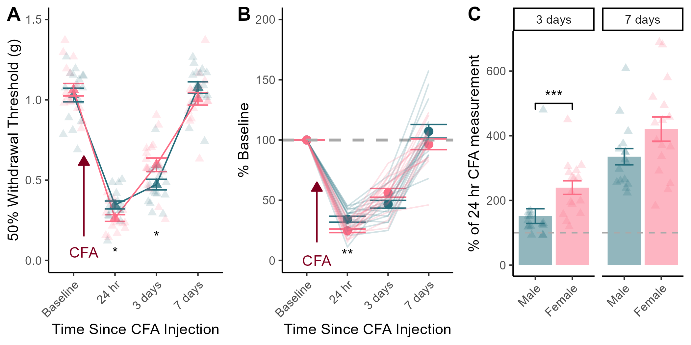

# Supplemental Figure 2 - Sex differences in CFA Hypersensitivity & Recovery {-}

```{r,include=FALSE}
knitr::opts_chunk$set(echo = FALSE,warning=FALSE,message=FALSE)
library(rlang)
library(tidyverse)
library(MASS)
library(reshape2)
library(ggpubr)
library(png)
library(tinytable)
library(rstatix)
```

```{r}
data <- read_csv("Data/CSV_4_R.csv")

data$CFA <- as.character(data$CFA)
data$CFA <- factor(data$CFA, levels=unique(data$CFA))

data$Sex <- as.character(data$Sex)
data$Sex <- factor(data$Sex, levels=c("Male","Female"))

CFAs <- subset(data[data$CFA == "CFA", ])

CFAs_left <- subset(CFAs[ ,1:4])
CFAs_left$hr_24 <- CFAs$hr_24.L
CFAs_left$days_3 <- CFAs$days_3.L
CFAs_left$days_7 <- CFAs$days_7.L

CFAs_right <- subset(CFAs[ ,1:3])
CFAs_right$Baseline <- CFAs$BL_R
CFAs_right$hr_24 <- CFAs$hr_24.R
CFAs_right$days_3 <- CFAs$days_3.R
CFAs_right$days_7 <- CFAs$days_7.R
```


```{r}
colnames(CFAs_left) <- c("ID", "Sex", "CFA", "Baseline", "24 hr", "3 days", "7 days")

a <- CFAs_left %>%
  melt(id.vars=c("ID","Sex","CFA")) 

A <- a %>%
  group_by(Sex,variable) %>%
  summarise(
    n=n(),
    mean=mean(value),
    sd=sd(value)
  ) %>% mutate(se = sd / sqrt(n)) %>% 
  ggplot(aes(x=variable,y=mean,colour=Sex,group=Sex))+
  geom_point(size=2.5,alpha=0.8,shape="triangle") +
  geom_line()+
  geom_errorbar(aes(ymin=mean-se,ymax=mean+se),width=0.5)+
  geom_jitter(data=a,aes(x=variable,y=value),width=0.25,height=0,size=2,alpha=0.15,shape="triangle")+
  scale_colour_manual(values = c("#256D7B", "#FC6C85"))+
  theme_classic()+
  theme(plot.title = element_text(hjust = 0.5))+
  theme(legend.position="none")+
  theme(axis.text.x=element_text(angle=45, hjust=1))+
  labs(y = "50% Withdrawal Threshold (g)",
       x = "Time Since CFA Injection"
       )+
   ylim(0,1.5)

A <- A +
  annotate("segment",x=1.25,y=.15,xend=1.25,yend= .65,colour="#800020",arrow=arrow(type="closed", length=unit(0.06,"npc")))+
  annotate("text", x=1.25,y=.05,label="CFA", colour="#800020")+
  annotate("text",x=c(2,3),y=c(0.05,0.15),label=c("*","*"))
```

```{r}
a <- CFAs_left %>%
  mutate(`24 hr` = (`24 hr` / `Baseline`) * 100) %>%
  mutate(`3 days` = (`3 days` / `Baseline`) * 100) %>%
  mutate(`7 days` = (`7 days` / `Baseline`) * 100) %>%
  mutate(Baseline = 100) %>%
  melt(id.vars=c("ID","Sex","CFA"))

b <- a %>%
  group_by(Sex,variable) %>%
  summarise(
    n=n(),
    mean=mean(value),
    sd=sd(value)
  ) %>% mutate(se = sd / sqrt(n)) %>%
  ggplot(aes(x=variable,y=mean,colour=Sex))+
  geom_point(size=2.5)+
  geom_errorbar(aes(ymin=mean-se,ymax=mean+se))+
  scale_colour_manual(values = c("#256D7B", "#FC6C85"))+
  geom_hline(yintercept=100,linetype="dashed",linewidth=1,colour="darkgrey")+
  theme_classic()+
  theme(plot.title = element_text(hjust = 0.5))+
  theme(legend.position="none")+
  theme(axis.text.x=element_text(angle=45, hjust=1))+
  labs(y = "% Baseline",
       x = "Time Since CFA Injection"
       )+
  ylim(0,200)

B <- b +
  geom_line(data=a,aes(x=variable,y=value,colour=Sex,group=ID),alpha=0.2)

B <- B + 
  annotate("segment",x=1.25,y=15,xend=1.25,yend= 65,colour="#800020",arrow=arrow(type="closed", length=unit(0.06,"npc")))+
  annotate("text", x=1.25,y=.05,label="CFA", colour="#800020")+
  annotate("text",x=2,y=5,label="**")

```

```{r}
a <- CFAs_left %>%
  mutate(`3 days` = (`3 days` / `24 hr`) * 100) %>%
  mutate(`7 days` = (`7 days` / `24 hr`) * 100) 

a <- a %>%
  dplyr::select(c("ID","CFA","Sex",`3 days`,`7 days`)) %>%
  reshape2::melt(id.vars=c("ID","CFA","Sex"))

C <- a %>% 
  group_by(Sex,variable) %>%
  summarise(
    n=n(),
    mean=mean(value),
    sd=sd(value) 
  ) %>% mutate(se = sd / sqrt(n)) %>%
  ggplot(aes(x=Sex,y=mean,colour=Sex,fill=Sex))+
  geom_bar(stat="identity",alpha=0.5,colour=NA)+
  geom_errorbar(aes(ymin=mean-se,ymax=mean+se),width=0.5)+
  scale_colour_manual(values=c("#256D7B", "#FC6C85"))+
  scale_fill_manual(values=c("#256D7B", "#FC6C85"))+
  geom_jitter(data=a,aes(x=Sex,y=value),size=2,alpha=0.2,width=0.25,height = 0,shape="triangle")+
  geom_hline(yintercept = 100,linetype="dashed",linewidth=0.5,colour="darkgrey")+
  theme_classic()+
  theme(legend.position="none")+
  theme(axis.text.x=element_text(angle=45, hjust=1))+
  labs(
    x="",
    y="% of 24 hr CFA measurement"
  )+
  facet_wrap(~variable)

x <- data.frame(
  variable="3 days",
  Sex="Male",
  end="Female",
  y=500,
  label="***"
)

C <- C +
  geom_signif(data=x,aes(xmin=Sex,xmax=end,annotations=label,y_position = y),colour="black",manual=TRUE)

C

```

## Published Image {-}

```{r}
panel <- ggarrange(A,B,C,
          nrow=1,ncol = 3,
          labels=c("A","B","C"))

ggsave("Figs/S2_MvF_CFA.png",panel,height = 3.5,width = 7,dpi=300)

# ggsave("Figs/tiffs/S2_MvF_CFA.tiff",panel,height=3.5,width=7,dpi=700,device="tiff",bg="white")


```

**Figure S2.** *Sex differences in hypersensitivity caused by CFA injection.* (A) Female mice exhibit more sensitivity than males 24 hours after CFA, but less sensitivity than males 3 days post administration. (B) CFA induced more robust sensitivity in female mice than males at the 24 hour post injection timepoint, relative to the individual baseline measurements. (C) Female mice exhibited a greater resolution of sensitivity than did males between the first two post CFA VF measurements. Data expressed as mean value +/- SEM, \*\*\* indicates p \< 0.001, \*\* indicates p \< 0.01, \* indicates p \< 0.05.

## Statistics {-}
```{r,echo= TRUE}
# Raw VF values - stats
a <- CFAs_left %>%
  melt(id.vars=c("ID","Sex","CFA")) 

b <- a %>%
  group_by(variable) %>%
  pairwise_t_test(value~Sex)

tt(b)
```

- There were no sex differences in basal paw withdrawal thresholds (p = 0.57)
- 24 hours post CFA, female mice had lower paw withdrawal thresholds than males(p - 0.017)
- 3 days post CFA, female mice had higher paw withdrawal thresholds than females(p=0.028)

```{r,echo=TRUE}
# % Baseline Stats
a <- CFAs_left %>%
  mutate(`24 hr` = (`24 hr` / `Baseline`) * 100) %>%
  mutate(`3 days` = (`3 days` / `Baseline`) * 100) %>%
  mutate(`7 days` = (`7 days` / `Baseline`) * 100) %>%
  mutate(Baseline = 100) %>%
  melt(id.vars=c("ID","Sex","CFA")) %>%
  filter(CFA == "CFA")

b <- a %>% 
  group_by(variable) %>%
  pairwise_t_test(value~Sex)

tt(b)
```

- at the 24 hour timepoint, the % baseline value for female CFA-injected mice was lower than for CFA-injected males (p = 0.0023)

- Three and Seven days post-injection, there was no sex difference in the % baseline (p = 0.061, p = 0.15, respectively).

These findings suggest that there may be sex differences in the timecourese of recovery after CFA injection in our model. Females initially exhibit more robust sensitivity at the site of CFA injection compared to males, but exhibit more recovery than males during the following 48 hour interval. 


