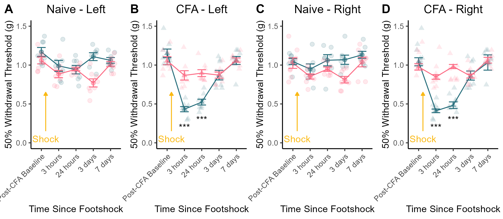

# Supplemental Figure 4 - Sex Differences in Shock-Induced Sensitivity {-}

```{r,include=FALSE}
knitr::opts_chunk$set(echo = FALSE,warning=FALSE,message=FALSE)
library(tidyverse)
library(reshape2)
library(ggpubr)
library(png)
library(tinytable)
library(rstatix)

options(scipen=999)
```


```{r}
Male_data <- read_csv("Data/FC_VF_CSV_R.csv")
Female_data <- read_csv("Data/Female_FC_VF_CSV_R.csv")

Male_data$CFA <- as.character(Male_data$CFA)
Male_data$CFA <- factor(Male_data$CFA, levels=unique(Male_data$CFA))

Female_data$CFA <- as.character(Female_data$CFA)
Female_data$CFA <- factor(Female_data$CFA, levels=unique(Female_data$CFA))

Male_data$Sex <- "Male"
Female_data$Sex <- "Female"

data <- rbind(Male_data,Female_data)
data$Sex <- as.character(data$Sex)
data$Sex <- factor(data$Sex,levels=c("Male","Female"))

Left_data <- data[ , c(1:2,13,3,5,7,9,11)]
colnames(Left_data) <- c("ID","CFA","Sex","Post-CFA Baseline","3 hours","24 hours", "3 days", "7 days")

Right_data <- data[ , c(1:2,13,4,6,8,10,12)]
colnames(Right_data) <- c("ID","CFA","Sex","Post-CFA Baseline","3 hours","24 hours", "3 days", "7 days")
```


```{r}
# Means Graph
## Left and Right paws needed here bc footshock was delivered bilaterally. 

a <- Left_data %>%
  melt(id.vars = c("ID","Sex","CFA")) %>% 
  filter(CFA == "Naive") 

A <- a %>%
  group_by(Sex,CFA,variable) %>%
  summarise(
    n=n(),
    mean=mean(value),
    sd=sd(value)
  ) %>% mutate(se = sd / sqrt(n)) %>%
  ggplot(aes(x=variable,y=mean,colour=Sex,group=Sex))+
  geom_point(size=2,alpha=0.5)+
  geom_line()+
  geom_errorbar(aes(ymin=mean-se,ymax=mean+se),width=0.5)+
  geom_jitter(data=a,aes(x=variable,y=value),width=0.25,height=0,size=2,alpha=0.15)+
  scale_colour_manual(values = c("#256D7B", "#FC6C85"))+
  theme_classic()+
  theme(plot.title = element_text(hjust = 0.5))+
  theme(legend.position="none")+
  theme(axis.text.x=element_text(angle=45, hjust=1))+
  labs(y = "50% Withdrawal Threshold (g)",
       x = "Time Since Footshock",
       title = "Naive - Left"
       )+
   ylim(0,1.5)

A <- A +
  annotate("segment",x=1.25,y=.15,xend=1.25,yend= .65,colour="#FAB914",arrow=arrow(type="closed", length=unit(0.04,"npc")))+
  annotate("text", x=1.25,y=.05,label="Shock", colour="#FAB914")
  
a <- Left_data %>%
  melt(id.vars = c("ID","Sex","CFA")) %>% 
  filter(CFA == "CFA") 

B <- a  %>%
  group_by(Sex,CFA,variable) %>%
  summarise(
    n=n(),
    mean=mean(value),
    sd=sd(value)
  ) %>% mutate(se = sd / sqrt(n)) %>%
  ggplot(aes(x=variable,y=mean,colour=Sex,group=Sex))+
  geom_point(size=2,alpha=0.5,shape = "triangle")+
  geom_line()+
  geom_errorbar(aes(ymin=mean-se,ymax=mean+se),width=0.5)+
  geom_jitter(data=a,aes(x=variable,y=value),width=0.25,height=0,size=2,alpha=0.15,shape="triangle")+
  scale_colour_manual(values = c("#256D7B", "#FC6C85"))+
  theme_classic()+
  theme(plot.title = element_text(hjust = 0.5))+
  theme(legend.position="none")+
  theme(axis.text.x=element_text(angle=45, hjust=1))+
  labs(y = "50% Withdrawal Threshold (g)",
       x = "Time Since Footshock",
       title = "CFA - Left"
       )+
   ylim(0,1.5)

B <- B + 
  annotate("text",x=c(2,3),y=c(0.20,0.30),label=c("***","***"))+
  annotate("segment",x=1.25,y=.15,xend=1.25,yend= .65,colour="#FAB914",arrow=arrow(type="closed", length=unit(0.04,"npc")))+
  annotate("text", x=1.25,y=.05,label="Shock", colour="#FAB914")

b <- Right_data %>%
  melt(id.vars = c("ID","Sex","CFA")) %>% 
  filter(CFA == "Naive")

C <- b  %>%
  group_by(Sex,CFA,variable) %>%
  summarise(
    n=n(),
    mean=mean(value),
    sd=sd(value)
  ) %>% mutate(se = sd / sqrt(n)) %>%
  ggplot(aes(x=variable,y=mean,colour=Sex,group=Sex))+
  geom_point(size=2,alpha=0.5)+
  geom_line()+
  geom_errorbar(aes(ymin=mean-se,ymax=mean+se),width=0.5)+
  geom_jitter(data=b,aes(x=variable,y=value),width=0.25,height=0,size=2,alpha=0.15)+
  scale_colour_manual(values = c("#256D7B", "#FC6C85"))+
  theme_classic()+
  theme(plot.title = element_text(hjust = 0.5))+
  theme(legend.position="none")+
  theme(axis.text.x=element_text(angle=45, hjust=1))+
  labs(y = "50% Withdrawal Threshold (g)",
       x = "Time Since Footshock",
       title = "Naive - Right"
       )+
   ylim(0,1.5)

C <- C +
  annotate("segment",x=1.25,y=.15,xend=1.25,yend= .65,colour="#FAB914",arrow=arrow(type="closed", length=unit(0.04,"npc")))+
  annotate("text", x=1.25,y=.05,label="Shock", colour="#FAB914")
  
b <- Right_data %>%
  melt(id.vars = c("ID","Sex","CFA")) %>% 
  filter(CFA == "CFA")

D <- b %>%
  group_by(Sex,CFA,variable) %>%
  summarise(
    n=n(),
    mean=mean(value),
    sd=sd(value)
  ) %>% mutate(se = sd / sqrt(n)) %>%
  ggplot(aes(x=variable,y=mean,colour=Sex,group=Sex))+
  geom_point(size=2,alpha=0.5,shape="triangle")+
  geom_line()+
  geom_errorbar(aes(ymin=mean-se,ymax=mean+se),width=0.5)+
  geom_jitter(data=a,aes(x=variable,y=value),width=0.25,height=0,size=2,alpha=0.15,shape="triangle")+
  scale_colour_manual(values = c("#256D7B", "#FC6C85"))+
  theme_classic()+
  theme(plot.title = element_text(hjust = 0.5))+
  theme(legend.position="none")+
  theme(axis.text.x=element_text(angle=45, hjust=1))+
  labs(y = "50% Withdrawal Threshold (g)",
       x = "Time Since Footshock",
       title = "CFA - Right"
       )+
   ylim(0,1.5)

D <- D + 
  annotate("text",x=c(2,3),y=c(0.20,0.30),label=c("***","***"))+
  annotate("segment",x=1.25,y=.15,xend=1.25,yend= .65,colour="#FAB914",arrow=arrow(type="closed", length=unit(0.04,"npc")))+
  annotate("text", x=1.25,y=.05,label="Shock", colour="#FAB914")


panel <- ggarrange(A,B,C,D,labels = c("A","B","C","D"),nrow=1)

ggsave("Figs/S4_Shock.png",height=3.5,width=8,dpi=300)

# ggsave("Figs/tiffs/S4_Shock.tiff",height=3.5,width=8,dpi=700,bg="white",device="tiff")
```

## Published Image {-}

```{r}

```

**Figure S4.** *Sex differences in footshock-induced expression of hyperalgesic priming.* (A) There was no sex difference in the magnitude of footshock-induced mechanical sensitivity among nive mice. (B) CFA-primed mice males exhibited expression of hyperalgesic priming at the site of previous injury whereas female CFA-primed mice did not. (C) Naive mice did not express footshock induced changes in sensitivity, but (D) male CFA-primed mice exhibited expression of hyperalgesic priming after footshock in their right paw as well (which had not been injured by CFA). Data expressed as mean value +/- SEM, \*\*\* indicates p \< 0.001.

## Statistics {-}

```{r,echo = TRUE}
## CFA-primed: Left Paws

a <- Left_data %>%
  melt(id.vars = c("ID","Sex","CFA")) %>% 
  filter(CFA == "CFA")

b <- aov(data=a,value~variable*Sex)
summary(b)

c <- a %>%
  group_by(variable) %>%
  pairwise_t_test(value~Sex)

tt(c)
```

- Both Three and 24 hours after footshock, CFA-primed males exhibit more hypersensitvity than CFA-primed females.

- There are no group differences at baseline, 3 days post shock, or 7 days post shock.

```{r,echo=TRUE}
## CFA-primed: Right Paws

a <- Right_data %>%
  melt(id.vars = c("ID","Sex","CFA")) %>% 
  filter(CFA == "CFA")

b <- aov(data=a,value~variable*Sex)
summary(b)

c <- a %>%
  group_by(variable) %>%
  pairwise_t_test(value~Sex)

tt(c)
```

- Both Three and 24 hours after footshock, CFA-primed males exhibit more hypersensitvity than CFA-primed females.

- There are no group differences at baseline, 3 days post shock, or 7 days post shock.

Similar statistical results for the left and right hind paws indicate that the expression of hyperalgesic priming is not limited to the site of previous injury in male mice. 

