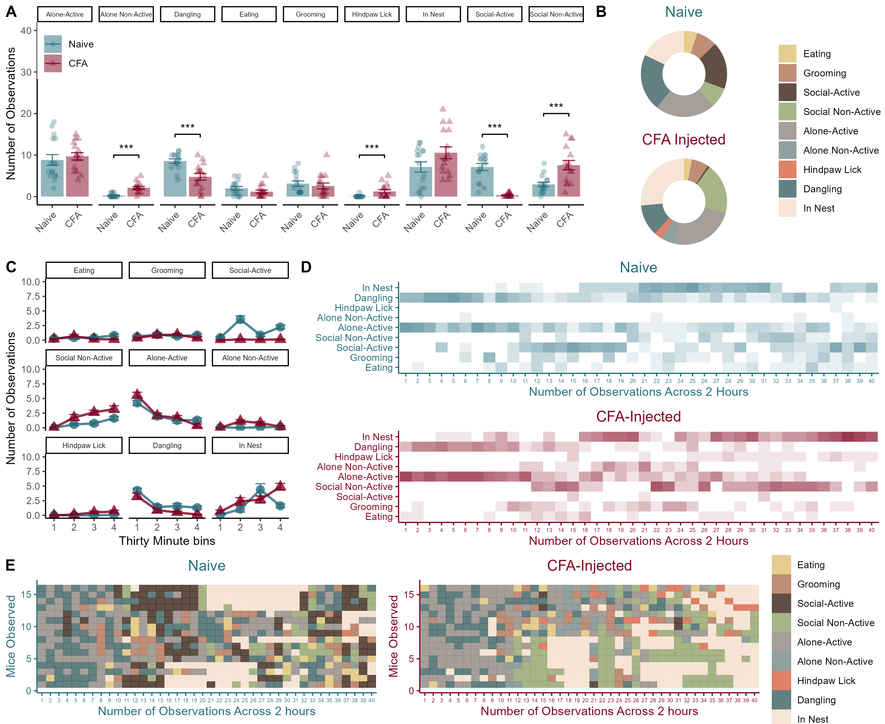
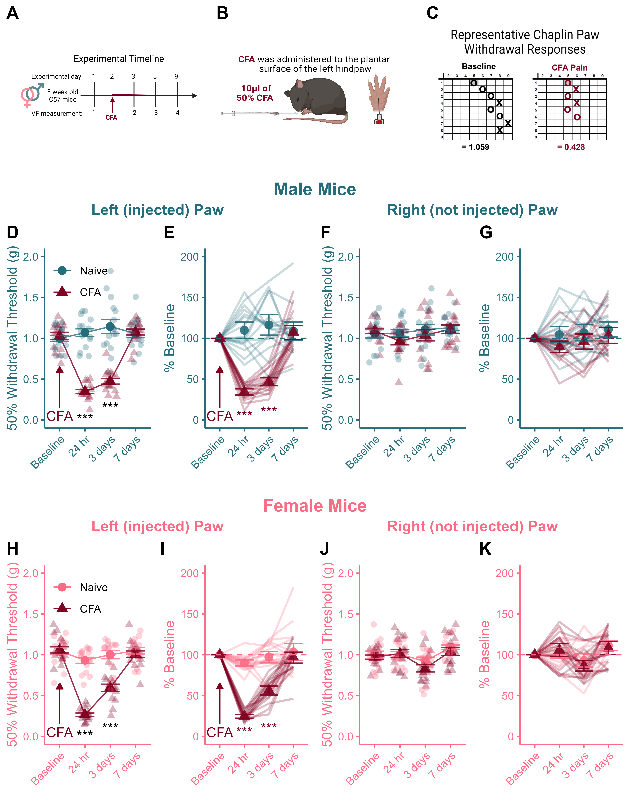

--- 
title: "Sex Differences in Pain Sensitization Book of Data"
site: bookdown::bookdown_site
documentclass: book
bibliography: [book.bib, packages.bib]
# url: your book url like https://bookdown.org/yihui/bookdown
# cover-image: path to the social sharing image like images/cover.jpg
description: |
  This is a minimal example of using the bookdown package to write a book.
  The HTML output format for this example is bookdown::gitbook,
  set in the _output.yml file.
link-citations: yes
github-repo: rstudio/bookdown-demo
---

# About {-}

This bookdown project contains R code and statistical outputs, and code to generate analyses for the paper **Inflammatory injury induces pain sensitization that is expressed beyond the site of injury in male (and not in female) mice**. 

- Raw data and code to generate the figure panels are available on our github.

- Code to generate the figures and statistical analyses was written by Jennet Baumbach.

- Any questions about these data should be directed to the corresponding author: Loren Martin, Ph.D lj.martin@utoronto.ca

<!--chapter:end:index.Rmd-->

---
output: html_document
---

# Figure 1 - Homecage Behaviors after CFA in male mice {-}

```{r setup, include=FALSE}
knitr::opts_chunk$set(echo = TRUE)
library(tidyverse)
library(reshape2)
library(ggpubr)

options(scipen = 999)
```

## Published Image {-}

```{r,analyze_CFA_HC_Behaviours,include=FALSE}
### Overall Bar graph

male_data <- read_csv("Data/HC_CFA_Males_R.csv")
male_data$Condition <- as.character(male_data$Condition)
male_data$Condition <- factor(male_data$Condition,levels = unique(male_data$Condition))

m_male_data <- melt(male_data, id.vars=c("ID","Condition"))
m_male_data$value <- factor(m_male_data$value,
                            levels=c(1:10),
                            labels=c("Eating","Grooming","Social-Active","Social Non-Active","Alone-Active","Alone Non-Active","Hindpaw Lick","Digging","Dangling","In Nest"))

m_male_data$x <- as.character(m_male_data$variable)

m_male_data$Obs_value <- word(m_male_data$x, 2, sep="_") %>%
  factor(levels=c(1:40))

colnames(m_male_data) <- c("ID","Condition","variable","value","Junk","Obs_value")

a <- m_male_data %>%
  group_by(ID,Condition,value) %>%
  summarise(
    my_count=n()
  ) 
  
b <- dcast(a,ID+Condition~value,value.var = "my_count")

b <- b %>% 
  mutate_at(c(3:11), ~replace(., is.na(.), 0))

c <- melt(b,id.vars = c("ID","Condition"))
  
d <- c %>%
  group_by(Condition,variable) %>%
  summarise(
    n=n(),
    mean=mean(value),
    sd=sd(value)
  ) %>% mutate(se = sd / sqrt(n-1)) %>%
  ggplot(aes(x=Condition,y=mean,colour=Condition,fill=Condition))+
  geom_bar(stat="identity",alpha=0.5,colour=NA)+
  geom_errorbar(aes(x=Condition,ymin=mean-se,ymax=mean+se),width=0.5,alpha=0.8)+
  scale_colour_manual(values=c("#256D7B", "#800020"))+
  scale_fill_manual(values=c("#256D7B", "#800020"))+
  facet_wrap(~variable,ncol=9)+
  theme_classic()+
  theme(legend.position = c(0,1), legend.justification = c(0,1))+
  theme(plot.title=element_text(hjust=0.5))+
  theme(axis.text.x = element_text(angle = 45, vjust = 1, hjust=1))+
  theme(strip.text=element_text(size=6))+
  ylim(0,40)

A <- d + 
  geom_jitter(data=c,aes(x=Condition,y=value,shape=Condition),size=2,alpha=0.3,height=0,width=0.15)+
  labs(x="",y="Number of Observations",colour=NULL,fill=NULL,shape=NULL)

x <- data.frame(variable = c("Social-Active", "Social Non-Active", "Alone Non-Active", "Hindpaw Lick","Dangling"),
                Condition = c("Naive","Naive","Naive","Naive","Naive"),
                end = c("CFA","CFA","CFA","CFA","CFA"),
                y = c(15,20,10,10,15),
                label=c("***","***","***","***","***"))

A <- A +
  geom_signif(data=x,aes(xmin=Condition,xmax=end,annotations=label,y_position = y),colour="black",manual=TRUE)
```

```{r,CFA_HC_Behavs Donut Chart,include=FALSE}
## Donut Charts

a <- m_male_data %>%
  group_by(ID,Condition,value) %>%
  summarise(
    my_count=n()
  ) 
  
b <- dcast(a,ID+Condition~value,value.var = "my_count")

b <- b %>% 
  mutate_at(c(3:11), ~replace(., is.na(.), 0))

c <- melt(b,id.vars = c("ID","Condition"))
  
d <- c %>%
  group_by(Condition,variable) %>%
  summarise(
    n=n(),
    mean=mean(value),
    sd=sd(value)
  ) %>% mutate(se = sd / sqrt(n-1))

d$perc = (d$mean / 40) * 100

Naives <- d[d$Condition == "Naive", ]
Naives$perc <- (Naives$mean / 40) * 100
CFAs <- d[d$Condition == "CFA", ]
CFAs$perc  <- (CFAs$mean / 40) * 100

Naives$ymax = cumsum(Naives$perc)
Naives$ymin = c(0,head(Naives$ymax,n=-1))

CFAs$ymax = cumsum(CFAs$perc)
CFAs$ymin = c(0,head(CFAs$ymax,n=-1))

my_colours <- c("#ddc173","#b07154","#3a2317", "#91a16a","#8e8680","#738986","#d76144","#3b6061","#f4decb")

a <- ggplot(Naives, aes(ymax=ymax, ymin=ymin, xmax=4, xmin=3, fill=variable))+
  geom_rect(alpha=0.8) +
  scale_fill_manual(values=my_colours)+
  coord_polar(theta="y")+
  theme_void()+
  theme(plot.title=element_text(hjust = 0.5,colour="#256D7B"))+
  labs(fill=NULL,title="Naive")+
  xlim(c(2,4))

b <- ggplot(CFAs, aes(ymax=ymax, ymin=ymin, xmax=4, xmin=3, fill=variable))+
  geom_rect(alpha=0.8) +
  scale_fill_manual(values=my_colours)+
  coord_polar(theta="y")+
  theme_void()+
  theme(plot.title=element_text(hjust = 0.5,colour="#800020"))+
  labs(fill=NULL,title="CFA Injected")+
  xlim(c(2,4))

Donuts <- ggarrange(a,b,nrow=2,ncol=1,common.legend = TRUE,legend = "right")
```

```{r,CFA_HC_Behavs Tiles,include=FALSE}
## Tile chart

my_colours <- c("#ddc173","#b07154","#3a2317", "#91a16a","#8e8680","#738986","#d76144","#3b6061","#f4decb")

m_male_data %>%
  ggplot(aes(x=ID,y=Obs_value,colour=value,fill=value))+
  geom_tile()+
  scale_colour_manual(values = my_colours)+
  scale_fill_manual(values = my_colours)+
  theme_classic()+
  coord_flip()

N_mice <- m_male_data[m_male_data$Condition == "Naive", ]
CFA_mice <- m_male_data[m_male_data$Condition == "CFA", ]

a <- N_mice %>%
  mutate(dumm_ID=rep(1:16,40)) %>%
  ggplot(aes(x=dumm_ID,y=Obs_value,colour=value,fill=value))+
  geom_tile(alpha=0.8)+
  scale_colour_manual(values = my_colours)+
  scale_fill_manual(values = my_colours)+
  theme_classic()+
  theme(plot.title=element_text(hjust=0.5))+
  theme(axis.text.x = element_text(size=5))+
  theme(
    axis.text = element_text(colour="#256D7B"),
    axis.ticks = element_line(colour="#256D7B"),
    axis.line = element_line(colour="#256D7B"),
    axis.title = element_text(colour = "#256D7B"),
    plot.title=element_text(colour="#256D7B"))+
  coord_flip()+
  labs(y="Number of Observations Across 2 hours", x="Mice Observed",title="Naive",colour=NULL,fill=NULL)


b <- CFA_mice %>%
  mutate(dumm_ID=rep(1:16,40)) %>%
  ggplot(aes(x=dumm_ID,y=Obs_value,colour=value,fill=value))+
  geom_tile(alpha=0.8)+
  scale_colour_manual(values = my_colours)+
  scale_fill_manual(values = my_colours)+
  theme_classic()+
  theme(plot.title=element_text(hjust=0.5))+
  theme(axis.text.x = element_text(size=5))+
  theme(
    axis.text = element_text(colour="#800020"),
    axis.ticks = element_line(colour="#800020"),
    axis.line = element_line(colour="#800020"),
    axis.title = element_text(colour = "#800020"),
    plot.title=element_text(colour="#800020"))+
  coord_flip()+
  labs(y="Number of Observations Across 2 hours", x="Mice Observed",title="CFA-Injected",colour=NULL,fill=NULL)

c <- N_mice %>%
  ggplot(aes(x=Obs_value,y=value))+
  geom_tile(alpha=0.1,fill="#256D7B")+
  theme_classic()+
  theme(plot.title=element_text(hjust=0.5))+
  theme(axis.text.x = element_text(size=5))+
  theme(
    axis.text = element_text(colour="#256D7B"),
    axis.ticks = element_line(colour="#256D7B"),
    axis.line = element_line(colour="#256D7B"),
    axis.title = element_text(colour = "#256D7B"),
    plot.title=element_text(colour="#256D7B"))+
  labs(x="Number of Observations Across 2 Hours",y="",title="Naive")

d <- CFA_mice %>%
  ggplot(aes(x=Obs_value,y=value))+
  geom_tile(alpha=0.1,fill="#800020")+
  theme_classic()+
  theme(plot.title=element_text(hjust=0.5))+
  theme(axis.text.x = element_text(size=5))+
  theme(
    axis.text = element_text(colour="#800020"),
    axis.ticks = element_line(colour="#800020"),
    axis.line = element_line(colour="#800020"),
    axis.title = element_text(colour = "#800020"),
    plot.title=element_text(colour="#800020"))+
  labs(x="Number of Observations Across 2 Hours",y="",title="CFA-Injected")

C <- ggarrange(a,b,nrow=1,ncol=2,common.legend = TRUE,legend = "right")

D <- ggarrange(c,d,nrow=2,ncol=1)
```


```{r,CFA_HC_Behavs_30min_Bins,include=FALSE}
## 30 minute bins graphs

thirty_min_bins <- as.data.frame(rep(1:4,each=(320)))
colnames(thirty_min_bins) <- "x"
m_male_data$thirty_bins <- thirty_min_bins$x

a <- m_male_data %>%
  group_by(ID,Condition,value,thirty_bins) %>%
  summarise(
    my_count=n()
  ) 
  
b <- dcast(a,ID+Condition+thirty_bins~value,value.var = "my_count")

b <- b %>% 
  mutate_at(c(4:12), ~replace(., is.na(.), 0))

c <- melt(b,id.vars = c("ID","Condition","thirty_bins"))

B <- c %>% 
  group_by(Condition,variable,thirty_bins) %>%
  summarise(
    n=n(),
    mean=mean(value),
    sd=sd(value)
  ) %>% mutate(se = sd / sqrt(n-1)) %>% 
  ggplot(aes(x=thirty_bins,y=mean,colour=Condition,shape=Condition))+
  geom_point(size=3.5,alpha=0.8)+
  geom_errorbar(aes(x=thirty_bins,ymin=mean-se,ymax=mean+se),width=0.5,alpha=0.8)+
  geom_line(size=1,alpha=0.8)+
  scale_colour_manual(values=c("#256D7B","#800020"))+
  theme_classic()+
  theme(legend.position = "none")+
  labs(x="Thirty Minute bins",y="Number of Observations")+
  facet_wrap(~variable,ncol=3)+
  theme(strip.text=element_text(size=6.5))+
  ylim(0,10)
```

```{r,echo = FALSE}
## Arrange Panel

top <- ggarrange(A,Donuts,
                 nrow=1,ncol=2,
                 widths=c(2,1),
                 labels=c("A","B"))
middle <- ggarrange(B,D,nrow=1,ncol=2,widths=c(1,2),labels=c("C","D"))

HC_panel <- ggarrange(top,middle,C,nrow=3,ncol=1,heights=c(1.5,1.75,1),labels = c("A","C","E"))+
  theme(panel.background = element_rect(fill="#FFFFFF",colour="#FFFFFF"))+
  theme(plot.background = element_rect(fill = "#FFFFFF", colour="#FFFFFF"))
ggsave("Figs/1_male_HC_panel.png",height=9,width=11,dpi=300)
# ggsave("Figs/tiffs/1_male_HC_panel.tiff",height=9,width=11,dpi=700,bg="white",device="tiff")
```

```{r, echo=FALSE}

```

**Figure 1.** *Homecage behaviors in male mice after an injection of 10*$\mu l$ *of 50% CFA.* (A) Total number of observations of each behavior category across the two-hour observation period. (B) Donut charts showing the breakdown of average time spent engaging in each behavior for each group. (C) Line charts showcase group differences in changes in behavior across the two-hour long session. (D and E) are qualitative representations of the distribution of behaviors observed across the 40 time points. Data represented as mean value +/- SEM. $***$ indicates p < 0.001.

## Statistical Analyses {-}

### Overall MANOVA for HC Behavs for males {-}
```{r}
# All behaviours in the model throws an error - it knows that you need to leave one out I suppose. 

# It is important to leave one behavior out of the MANOVA to allow for a degree of freedom in the analysis. 

## I thought originally that I would leave time in the nest out, but bc there is a clear sex difference in that behaviour I chose eating instead here: 

fit <- manova(cbind(Grooming,`Social-Active`,`Social Non-Active`,`Alone-Active`,`Alone Non-Active`,`Hindpaw Lick`,`Dangling`,`In Nest`) ~ Condition, data=b)
summary(fit)
```

- The overall MANOVA for males was significant (F(1,30) = 43.46, p < 0.001), indicating that 10 $\mu l$ of 50% CFA altered patterns of behaviour during the two-hour interval after injection.

### Follow up analyses {-}
```{r}
# Prints out the individual ANOVAs for each behaviour
summary.aov(fit)
```

- Male mice that were injected with CFA exhibited fewer socially-active behaviours (F(1,30) = 66.62, p < 0.001),
- More socially inactive behaviours (F(1,30) = 14.55, p < 0.001), 
- More hindpaw licks (F(1,30) = 8.07, p = 0.008),
- And less time dangling (F(1,30) = 17.19, p < 0.001). 

*Note* that the non-statistically significant results shown above are not reported in the mauscript. 


<!--chapter:end:01-Male_Homecage.Rmd-->

---
output: html_document
---

# Figure 2 - Female Mice: Homecage Behaviors after CFA {-}

```{r setup_f_HC, include=FALSE}
knitr::opts_chunk$set(echo = TRUE)
library(tidyverse)
library(reshape2)
library(ggpubr)

options(scipen = 999)
```

## Published Image{-}

```{r,F_analyze_CFA_HC_Behaviours,include=FALSE}
male_data <- read_csv("Data/F_HC_CFA_R.csv")
male_data$Condition <- as.character(male_data$Condition)
male_data$Condition <- factor(male_data$Condition,levels = unique(male_data$Condition))

m_male_data <- melt(male_data, id.vars=c("ID","Condition"))
m_male_data$value <- factor(m_male_data$value,
                            levels=c(1:10),
                            labels=c("Eating","Grooming","Social-Active","Social Non-Active","Alone-Active","Alone Non-Active","Hindpaw Lick","Digging","Dangling","In Nest"))

m_male_data$x <- as.character(m_male_data$variable)

m_male_data$Obs_value <- word(m_male_data$x, 2, sep="_") %>%
  factor(levels=c(1:40))

colnames(m_male_data) <- c("ID","Condition","variable","value","Junk","Obs_value")

a <- m_male_data %>%
  group_by(ID,Condition,value) %>%
  summarise(
    my_count=n()
  ) 
  
b <- dcast(a,ID+Condition~value,value.var = "my_count")

b <- b %>% 
  mutate_at(c(3:11), ~replace(., is.na(.), 0))

c <- melt(b,id.vars = c("ID","Condition"))%>%
  filter (variable != "Digging")
  
d <- c %>%
  group_by(Condition,variable) %>%
  summarise(
    n=n(),
    mean=mean(value),
    sd=sd(value)
  ) %>% mutate(se = sd / sqrt(n-1)) %>%
  ggplot(aes(x=Condition,y=mean,colour=Condition,fill=Condition))+
  geom_bar(stat="identity",alpha=0.5,colour=NA)+
  geom_errorbar(aes(x=Condition,ymin=mean-se,ymax=mean+se),width=0.5,alpha=0.8)+
  scale_colour_manual(values=c("#FC6C85", "#800020"))+
  scale_fill_manual(values=c("#FC6C85", "#800020"))+
  facet_wrap(~variable,ncol=9)+
  theme_classic()+
  theme(legend.position = c(0,1), legend.justification = c(0,1))+
  theme(plot.title=element_text(hjust=0.5))+
  theme(axis.text.x = element_text(angle = 45, vjust = 1, hjust=1))+
  theme(strip.text=element_text(size=6.))+
  ylim(0,50)

A <- d + 
  geom_jitter(data=c,aes(x=Condition,y=value,shape=Condition),size=2,alpha=0.3,height=0,width=0.15)+
  labs(x="",y="Number of Observations",colour=NULL,fill=NULL,shape=NULL)

x <- data.frame(variable = c("Grooming", "Social Non-Active", "Hindpaw Lick","In Nest"),
                Condition = c("Naive","Naive","Naive","Naive"),
                end = c("CFA","CFA","CFA","CFA"),
                y = c(20,25,15,45),
                label=c("***","*","***","***"))

A <- A +
  geom_signif(data=x,aes(xmin=Condition,xmax=end,annotations=label,y_position = y),colour="black",manual=TRUE)
```

```{r,F_CFA_HC_Behavs Donut Chart,include=FALSE}
a <- m_male_data %>%
  group_by(ID,Condition,value) %>%
  summarise(
    my_count=n()
  ) 
  
b <- dcast(a,ID+Condition~value,value.var = "my_count")

b <- b %>% 
  mutate_at(c(3:11), ~replace(., is.na(.), 0))

c <- melt(b,id.vars = c("ID","Condition"))%>%
  filter (variable != "Digging")
  
d <- c %>%
  group_by(Condition,variable) %>%
  summarise(
    n=n(),
    mean=mean(value),
    sd=sd(value)
  ) %>% mutate(se = sd / sqrt(n-1))

d$perc = (d$mean / 40) * 100

Naives <- d[d$Condition == "Naive", ]
Naives$perc <- (Naives$mean / 40) * 100
CFAs <- d[d$Condition == "CFA", ]
CFAs$perc  <- (CFAs$mean / 40) * 100

Naives$ymax = cumsum(Naives$perc)
Naives$ymin = c(0,head(Naives$ymax,n=-1))

CFAs$ymax = cumsum(CFAs$perc)
CFAs$ymin = c(0,head(CFAs$ymax,n=-1))

my_colours <- c("#ddc173","#b07154","#3a2317", "#91a16a","#8e8680","#738986","#d76144","#3b6061","#f4decb")

a <- ggplot(Naives, aes(ymax=ymax, ymin=ymin, xmax=4, xmin=3, fill=variable))+
  geom_rect(alpha=0.8) +
  scale_fill_manual(values=my_colours)+
  coord_polar(theta="y")+
  theme_void()+
  theme(plot.title=element_text(hjust = 0.5))+
  labs(fill=NULL,title="Naive")+
  xlim(c(2,4))

b <- ggplot(CFAs, aes(ymax=ymax, ymin=ymin, xmax=4, xmin=3, fill=variable))+
  geom_rect(alpha=0.8) +
  scale_fill_manual(values=my_colours)+
  coord_polar(theta="y")+
  theme_void()+
  theme(plot.title=element_text(hjust = 0.5,colour="#800020"))+
  labs(fill=NULL,title="CFA Injected")+
  xlim(c(2,4))

Donuts <- ggarrange(a,b,nrow=2,ncol=1,common.legend = TRUE,legend = "right")
```

```{r,F_CFA_HC_Behavs Tiles,include=FALSE}
my_colours <- c("#ddc173","#b07154","#3a2317", "#91a16a","#8e8680","#738986","#d76144","#3b6061","#f4decb")

N_mice <- m_male_data[m_male_data$Condition == "Naive", ]
CFA_mice <- m_male_data[m_male_data$Condition == "CFA", ]

xtra <- data.frame(
  ID = c(0,0),
  Condition = c("Naive","Naive"),
  variable = c("Obs_0","Obs_0"),
  value = c("Alone Non-Active","Social-Active"),
  Junk = c("Obs_0","Obs_0"),
  Obs_value = c(40,40)
)

N_2 <- rbind(N_mice,xtra)

N_2$dumm_ID <- c(rep(1:16,40),rep(0,2))

a <- N_2 %>%
  filter(value != "Digging") %>%
  ggplot(aes(x=dumm_ID,y=Obs_value,colour=value,fill=value))+
  geom_tile(alpha=0.8)+
  scale_colour_manual(values = my_colours)+
  scale_fill_manual(values = my_colours)+
  theme_classic()+
  theme(plot.title=element_text(hjust=0.5))+
  theme(axis.text.x = element_text(size=5))+
  theme(
    axis.text = element_text(colour="#FC6C85"),
    axis.ticks = element_line(colour="#FC6C85"),
    axis.line = element_line(colour="#FC6C85"),
    axis.title = element_text(colour = "#FC6C85"),
    plot.title=element_text(colour="#FC6C85"))+
  coord_flip()+
  labs(y="Number of Observations Across 2 hours", 
       x="Mice Observed",title="Naive",
       colour=NULL,fill=NULL)+
  xlim(0,16)
a

b <- CFA_mice %>%
  mutate(dumm_ID=rep(1:16,40)) %>%
  filter(value != "Digging") %>% 
  ggplot(aes(x=dumm_ID,y=Obs_value,colour=value,fill=value))+
  geom_tile(alpha=0.8)+
  scale_colour_manual(values = my_colours)+
  scale_fill_manual(values = my_colours)+
  theme_classic()+
  theme(plot.title=element_text(hjust=0.5))+
  theme(axis.text.x = element_text(size=5))+
  theme(
    axis.text = element_text(colour="#800020"),
    axis.ticks = element_line(colour="#800020"),
    axis.line = element_line(colour="#800020"),
    axis.title = element_text(colour = "#800020"),
    plot.title=element_text(colour="#800020"))+
  coord_flip()+
  labs(y="Number of Observations Across 2 hours", x="Mice Observed",title="CFA-Injected",colour=NULL,fill=NULL)

c <- N_2 %>%
  filter(value != "Digging") %>%
  ggplot(aes(x=Obs_value,y=value))+
  geom_tile(alpha=0.1,fill="#FC6C85")+
  theme_classic()+
  theme(plot.title=element_text(hjust=0.5))+
  theme(axis.text.x = element_text(size=5))+
    theme(
    axis.text = element_text(colour="#FC6C85"),
    axis.ticks = element_line(colour="#FC6C85"),
    axis.line = element_line(colour="#FC6C85"),
    axis.title = element_text(colour = "#FC6C85"),
    plot.title=element_text(colour="#FC6C85"))+
  labs(x="Number of Observations Across 2 Hours",y="",title="Naive")

d <- CFA_mice  %>%
  filter(value != "Digging") %>%
  ggplot(aes(x=Obs_value,y=value))+
  geom_tile(alpha=0.1,fill="#800020")+
  theme_classic()+
  theme(plot.title=element_text(hjust=0.5))+
  theme(axis.text.x = element_text(size=5))+
  theme(
    axis.text = element_text(colour="#800020"),
    axis.ticks = element_line(colour="#800020"),
    axis.line = element_line(colour="#800020"),
    axis.title = element_text(colour = "#800020"),
    plot.title=element_text(colour="#800020"))+
  labs(x="Number of Observations Across 2 Hours",y="",title="CFA-Injected")

C <- ggarrange(a,b,nrow=1,ncol=2,common.legend = TRUE,legend = "right")

D <- ggarrange(c,d,nrow=2,ncol=1)

```

```{r,F_CFA_HC_Behavs_30min_Bins,include=FALSE}
thirty_min_bins <- as.data.frame(rep(1:4,each=(320)))
colnames(thirty_min_bins) <- "x"
m_male_data$thirty_bins <- thirty_min_bins$x

a <- m_male_data %>%
  group_by(ID,Condition,value,thirty_bins) %>%
  summarise(
    my_count=n()
  ) 
  
b <- dcast(a,ID+Condition+thirty_bins~value,value.var = "my_count")

b <- b %>% 
  mutate_at(c(4:13), ~replace(., is.na(.), 0))

c <- melt(b,id.vars = c("ID","Condition","thirty_bins"))%>%
  filter (variable != "Digging")

B <- c %>% 
  group_by(Condition,variable,thirty_bins) %>%
  summarise(
    n=n(),
    mean=mean(value),
    sd=sd(value)
  ) %>% mutate(se = sd / sqrt(n)) %>%
  ggplot(aes(x=thirty_bins,y=mean,colour=Condition,shape=Condition))+
  geom_point(size=3.5,alpha=0.8)+
  geom_errorbar(aes(x=thirty_bins,ymin=mean-se,ymax=mean+se),width=0.5,alpha=0.8)+
  geom_line(size=1,alpha=0.8)+
  scale_colour_manual(values=c("#FC6C85","#800020"))+
  theme_classic()+
  theme(legend.position = "none")+
  labs(x="Thirty Minute bins",y="Number of Observations")+
  facet_wrap(~variable,ncol=3)+
  theme(strip.text=element_text(size=6.5))

top <- ggarrange(A,Donuts,
                 nrow=1,ncol=2,
                 widths=c(2,1),
                 labels=c("A","B"))
middle <- ggarrange(B,D,nrow=1,ncol=2,widths=c(1,2),labels=c("C","D"))

HC_panel <- ggarrange(top,middle,C,nrow=3,ncol=1,heights=c(1.5,1.75,1),labels = c("A","C","E"))+
  theme(panel.background = element_rect(fill="#FFFFFF",colour="#FFFFFF"))+
  theme(plot.background = element_rect(fill = "#FFFFFF", colour="#FFFFFF"))
ggsave("Figs/2_female_HC_panel.png",height=9,width=11,dpi=300)
# ggsave("Figs/tiffs/2_female_HC_panel.tiff",height=9,width=11,dpi=700,device="tiff",bg="white")
```

```{r,echo = FALSE}

```

**Figure 2.** *Homecage behaviors in female mice after injection of 10*$\mu l$ *of 50% CFA.* (A) Total number of observations of each behavior category across the two-hour observation period. (B) Donut charts showing the breakdown of average time spent engaging in each behavior for each group. (C) Line charts showcase group differences in changes in behavior across the two-hour long session. (D and E) are qualitative representations of the distribution of behaviors observed across the 40 time points. Data represented as mean value +/- SEM. $***$ indicates p < 0.001.

## Statistical Analyses {-}


### Overall MANOVA for HC Behavs for females
```{r}
# All behaviours in the model throws an error - it knows that you need to leave one out I suppose. 
## I thought originally that I would leave time in the nest out, but bc there is a clear sex difference in that behaviour I chose eating instead here: 

fit <- manova(cbind(Grooming,`Social-Active`,`Social Non-Active`,`Alone-Active`,`Alone Non-Active`,`Hindpaw Lick`,`Dangling`,`In Nest`) ~ Condition, data=b)
summary(fit)
```

- The overall MANOVA for female mice was also significant (F(1,30) = 3.05, p = 0.017)

### Follow up:
```{r}
# Prints out the individual ANOVAs for each behaviour
summary.aov(fit)
```

CFA-injected Female mice exhibited: 

- Increased grooming during the observation session (F(1,30) = 12.26, p = 0.0015)
- Increased social inactive behaviour (F(1,30) = 4.626, p = 0.039)
- More hindpaw licks (F(1,30) = 15.95, p < 0.001)
- And less observations in the nest (F(1,30) = 10.93, p = 0.002)

<!--chapter:end:02-Female_Homecage.Rmd-->

---
output: html_document
---

```{r, Chunk Options}
knitr::opts_chunk$set(message = FALSE, 
                      warning = FALSE,
                      echo = FALSE,
                      fig.align = 'center')
options(scipen = 999)
```

# Figure 3 - Recovery from CFA Injury {-}

``` {r, Load packages}
library(tidyverse) # For tidy text
library(reshape2) # For melting
library(ggpubr) # For making panels
library(png) # To call in .png images
library(rstatix) # for Stats
library(tinytable)
```


```{r, Get Data & Wrangle}
## Get Data & Wrangle

data <- read_csv("Data/CSV_4_R.csv")

data$CFA <- as.character(data$CFA)
data$CFA <- factor(data$CFA, levels=unique(data$CFA))

female_data <- subset(data[data$Sex == "Female", 1:11, ])
female_left <- subset(female_data[ ,1:4])
female_left$hr_24 <- female_data$hr_24.L
female_left$days_3 <- female_data$days_3.L
female_left$days_7 <- female_data$days_7.L
female_right <- subset(female_data[ ,1:3 ])
female_right$Baseline <- female_data$BL_R
female_right$hr_24 <- female_data$hr_24.R
female_right$days_3 <- female_data$days_3.R
female_right$days_7 <- female_data$days_7.R

male_data <- subset(data[data$Sex == "Male", 1:11, ])
male_left <- subset(male_data[ ,1:4])
male_left$hr_24 <- male_data$hr_24.L
male_left$days_3 <- male_data$days_3.L
male_left$days_7 <- male_data$days_7.L
male_right <- subset(male_data[ ,1:3])
male_right$Baseline <- male_data$BL_R
male_right$hr_24 <- male_data$hr_24.R
male_right$days_3 <- male_data$days_3.R
male_right$days_7 <- male_data$days_7.R
```


```{r, CFA_Recover_Lines Function Definition}
## CFA_Recover_Lines fun

CFA_Recover_Lines <- function(input,sex_colour){
  
colnames(input) <- c("ID", "Sex", "CFA", "Baseline", "24 hr", "3 days", "7 days")

a <- subset(input[-1])

means <- a %>% 
  group_by(`CFA`) %>% 
  summarise_at(vars(`Baseline`, `24 hr`, `3 days`, `7 days`), list(name=mean))
colnames(means) <- c("CFA", "Baseline", "24 hr", "3 days", "7 days")
means <- as.data.frame(means)
m_means <- melt(means)

sd <- a %>%
  group_by(`CFA`) %>%
  summarise_at(vars(`Baseline`, `24 hr`, `3 days`, `7 days`), list(name="sd"))

se <- sd / sqrt(15)
se$CFA <- sd$CFA
colnames(se) <- c("CFA", "Baseline", "24 hr", "3 days", "7 days")
se <- as.data.frame(se)
m_se <- melt(se)
m_se$mean <- m_means$value

a <- subset(a[-1])
a <- as.data.frame(a)
m_a <- melt(a)

b <- ggplot()+
  geom_line(data=m_means, aes(x=variable, y=value, group=CFA, colour=CFA), alpha=0.8)+
    scale_colour_manual(values = c(sex_colour, "#800020"))+
  geom_point(data=m_means, aes(x=variable, y=value, colour=CFA, shape=CFA), size=3)+
    scale_colour_manual(values = c(sex_colour, "#800020"))+
  geom_jitter(data=m_a, aes(x=variable, y=value, group=CFA, colour=CFA, shape=CFA), width=0.25,height=0, size=2, alpha=0.3)+
    scale_colour_manual(values = c(sex_colour, "#800020"))+
  geom_errorbar(data=m_se, aes(x=variable, ymin=mean-value, ymax=mean+value, colour=CFA), width=0.75, alpha=0.8)+
    scale_fill_manual(values = c(sex_colour, "#800020"))+
  theme_classic()+
  scale_y_continuous(expand = c(0, 0), limits= c(0,NA))+
  theme(plot.title = element_text(hjust = 0.5))+
  theme(legend.position="none")+
  theme(axis.title.x=element_text(colour=sex_colour))+
  theme(axis.title.y=element_text(colour=sex_colour))+
  theme(axis.text.x=element_text(colour=sex_colour))+
  theme(axis.text.y=element_text(colour=sex_colour))+
  theme(axis.text.x=element_text(angle=45, hjust=1))+
  theme(axis.line = element_line(colour=sex_colour))+
  theme(axis.ticks = element_line(colour=sex_colour))+
  labs(y = "50% Withdrawal Threshold (g)",
       x = "",
       title= ""
       )+
   ylim(0,2)

return(b)
}
```


```{r, individuals_lines function definition}
## Individuals_lines fun

individuals_lines <- function(input,sex_colour){

  colnames(input) <- c("ID", "Sex", "CFA", "Baseline", "24 hr", "3 days", "7 days")
  a <- subset(input[-2])
  b <- as.data.frame(a)
  b$`24 hr` <- (b$`24 hr`/b$Baseline)*100
  b$`3 days` <- (b$`3 days`/b$Baseline)*100
  b$`7 days` <- (b$`7 days`/b$Baseline)*100
  b$Baseline <- 100
  c <- melt(b, id.vars = c("ID", "CFA"))

means <- b %>% 
  group_by(`CFA`) %>% 
  summarise_at(vars(`Baseline`, `24 hr`, `3 days`, `7 days`), list(name=mean))
colnames(means) <- c("CFA", "Baseline", "24 hr", "3 days", "7 days")
means <- as.data.frame(means)
m_means <- melt(means)
  
sd <- b %>%
  group_by(`CFA`) %>%
  summarise_at(vars(`Baseline`, `24 hr`, `3 days`, `7 days`), list(name="sd"))

se <- sd / sqrt(7)
se$CFA <- sd$CFA
colnames(se) <- c("CFA", "Baseline", "24 hr", "3 days", "7 days")
se <- as.data.frame(se)
se$CFA <- sd$CFA
m_se <- melt(se)
m_se$mean <- m_means$value  
  
    
d <- ggplot(data=c, aes(x=variable, y=value, colour=CFA))+
  geom_line(data=c, group=c$ID, size=.8, alpha=0.25)+
  scale_colour_manual(values = c(sex_colour, "#800020"))+
  geom_point(data=m_se, aes(x=variable, y=mean, shape = CFA), size = 3, alpha=0.9)+
  geom_errorbar(data=m_se, aes(x=variable, ymin=mean-value, ymax=mean+value), alpha =0.9, width=0.75)+
  theme_classic()+
  theme(plot.title = element_text(hjust = 0.5))+
  theme(legend.position="left")+
  theme(axis.title.x=element_text(colour=sex_colour))+
  theme(axis.title.y=element_text(colour=sex_colour))+
  theme(axis.text.x=element_text(colour=sex_colour))+
  theme(axis.text.y=element_text(colour=sex_colour))+
  theme(axis.text.x=element_text(angle=45, hjust=1))+
  theme(axis.line = element_line(colour=sex_colour))+
  theme(axis.ticks = element_line(colour=sex_colour))+
  theme(legend.position = "none")+
  geom_hline(yintercept=100, linetype="dashed", colour=sex_colour)+
  labs(x = " ",
       y = "% Baseline",
       title = "")+
  ylim(0,200)

return(d)
}
```


```{r, warning=FALSE,message=FALSE}
## Generate charts

a <- CFA_Recover_Lines(female_left, "#FC6C85")
b <- CFA_Recover_Lines(female_right, "#FC6C85")
c <- CFA_Recover_Lines(male_left, "#256D7B")
d <- CFA_Recover_Lines(male_right, "#256D7B")

e <- individuals_lines(female_left, "#FC6C85")
f <- individuals_lines(female_right, "#FC6C85")
g <- individuals_lines(male_left, "#256D7B")
h <- individuals_lines(male_right, "#256D7B")
```


```{r, cartoons}

## Build the panel: 

## Call in cartoons

timeline <- readPNG("cartoons/fig.1_timeline.png")
mouse <- readPNG("cartoons/fig.1_mouse.png")
VF <- readPNG("cartoons/fig.1_VF.png")

AA <- ggplot()+
  background_image(timeline)+
  coord_equal(ratio=0.4)+
  theme(panel.background = element_rect(fill="#FFFFFF",colour="#FFFFFF"))+
  theme(plot.background = element_rect(fill = "#FFFFFF", colour="#FFFFFF"))
AB <- ggplot() +
  background_image(mouse)+
  coord_equal(ratio=0.4)+
  theme(panel.background = element_rect(fill="#FFFFFF",colour="#FFFFFF"))+
  theme(plot.background = element_rect(fill = "#FFFFFF", colour="#FFFFFF"))
AC <- ggplot() +
  background_image(VF)+
  coord_equal(ratio=0.75)+
  theme(panel.background = element_rect(fill="#FFFFFF",colour="#FFFFFF"))+
  theme(plot.background = element_rect(fill = "#FFFFFF", colour="#FFFFFF"))

cartoons <- ggarrange(AA,AB,AC,
                      nrow=1,ncol=3,
                      labels = c("A","B","C"))
```


```{r,customize graphs}
## Add significance indicators to left paw graphs.

C <- c +
  annotate("segment",x=1,y=.15,xend=1,yend= .65,colour="#800020",arrow=arrow(type="closed", length=unit(0.06,"npc")))+
  annotate("text", x=1,y=.05,label="CFA", colour="#800020")+
  annotate("text",x=c(2,3),y=c(0.01,0.15),label=c("***"),size=4)+
  theme(legend.justification = c(0,0.8),legend.position=c(0,1))+
  theme(legend.background=element_rect(fill="transparent"))+
  labs(color=" ",
       shape=" ")
 
G <- g + 
  annotate("segment",x=1,y=15,xend=1,yend= 65,colour="#800020",arrow=arrow(type="closed", length=unit(0.06,"npc")))+
  annotate("text", x=1,y=5,label="CFA", colour="#800020")+
  annotate("text",x=c(2,3),y=c(5,10),label=c("***"),size=4, colour="#800020")

A <- a +
  annotate("segment",x=1,y=.15,xend=1,yend= .65,colour="#800020",arrow=arrow(type="closed", length=unit(0.06,"npc")))+
  annotate("text", x=1,y=.05,label="CFA", colour="#800020")+
  theme(legend.justification = c(0,0.8),legend.position=c(0,1))+
  theme(legend.background=element_rect(fill="transparent"))+
  labs(color=" ",
       shape=" ")+
    annotate("text",x=c(2,3),y=c(0.01,0.1),label=c("***"),size=4)

E <- e + 
  annotate("segment",x=1,y=15,xend=1,yend= 65,colour="#800020",arrow=arrow(type="closed", length=unit(0.06,"npc")))+
  annotate("text", x=1,y=5,label="CFA", colour="#800020")+
    annotate("text",x=c(2,3),y=c(5,10),label=c("***"),size=4, colour="#800020")
```

```{r, arrange panel}
## Arrange pieces of the Fig.3 Panel

M_L <- ggarrange(C,G,
                 nrow=1,ncol=2,
                 labels=c("D","E"))
M_L <- annotate_figure(M_L, top = text_grob("Left (injected) Paw", color="#256D7B",face="bold",size="12"))

M_R <- ggarrange(d,h,
                 nrow=1,ncol=2,
                 labels=c("F","G"))
M_R <- annotate_figure(M_R, top = text_grob("Right (not injected) Paw", color="#256D7B",face="bold",size="12"))


F_L <- ggarrange(A,E,
                 nrow=1,ncol=2,
                 labels=c("H","I"))
F_L <- annotate_figure(F_L, top = text_grob("Left (injected) Paw", color="#FC6C85",face="bold",size="12"))

F_R <- ggarrange(b,f,
                 nrow=1,ncol=2,
                 labels=c("J","K"))
F_R <- annotate_figure(F_R, top = text_grob("Right (not injected) Paw", color="#FC6C85",face="bold",size="12"))

male <- ggarrange(M_L,M_R,
                  ncol=2,nrow=1)
male <- annotate_figure(male, top = text_grob("Male Mice", color="#256D7B", face="bold",size="14"))

female <- ggarrange(F_L,F_R,
                     ncol=2,nrow=1)
female <- annotate_figure(female, top = text_grob("Female Mice", color = "#FC6C85", face="bold",size="14"))

panel <- ggarrange(male,female,
                   ncol=1,nrow=2,
                   heights = c(3,3))

final_panel <- ggarrange(cartoons,panel,
                         nrow=2,ncol=1,
                         heights = c(2.25,8))
```

```{r}
ggsave(filename="Figs/3_VF_CFA_Recovery.png",final_panel, height=9,width=7,dpi=700,bg="white") 

# ggsave(filename="Figs/tiffs/3_VF_CFA_Recovery.tiff",final_panel,height=9,width=7,dpi=700,bg="white")
```

## Published Image {-}

```{r}

```

**Figure 3.** *CFA injection produces mechanical hypersensitivity that resolves within 7 days in male and female mice.* (A) Timeline of experimental testing. (B) Pain model to induce sensitization. (C) Representative images of Chaplan up-down von Frey measurements after CFA injection. CFA administration produces robust hypersensitivity at the site of injection that persists for at least 3 days and resolves within one week in both male (D, E) and female (H, I) mice. There were no changes in sensitivity of the contralateral (non-injected; right) hind paw during inflammatory pain and recovery from CFA injury in either males (F, G) or females (J, K). Data expressed as mean +/- SEM. $***$ Indicates between-group difference where *p* < 0.001 and # indicates a within-subject difference from baseline where *p* < 0.05.

## Statistical Analyses {-}
```{r, echo= TRUE}
# Select the left paws
left_paws <- rbind(female_left,male_left)

# Switch to long form
a <- left_paws %>% 
  melt(id.vars=c("ID","Sex","CFA"))

# Run RM anova on the 4 days of VF measuremenets
b <- anova_test(data=a, dv=value,wid=ID,between=c(CFA,Sex),within=variable,effect.size="pes")
knitr::kable(get_anova_table(b))
```

- Significant main effects of CFA and timepoint. 

- Significant interaction between CFA and timepoint (F(3,180) = 91.67, p < 0.001)

- Significant 3-way interaction between Sex, CFA and timepoint (F(3,180) = 3.57, p = 0.015)

```{r,echo = TRUE}
# Run two way ANOVAs for males and females separately: 

## Males
res <- a %>%
  filter(Sex == "Male") %>%
  anova_test(dv=value,wid=ID,between=CFA,within=variable,effect.size = "pes")
```

There is a significant interaction between CFA treatment and time point (F(3,90) = 47.44, p < 0.001)

```{r,echo=TRUE}
### Follow up for males: 
res <- a %>% 
  filter(Sex == "Male") %>%
  group_by(variable) %>%
  pairwise_t_test(value~CFA,p.adjust.method = "bonferroni")

tt(res)
```

- CFA-injected males have lower paw withdrawal thresholds than naive males 24 hours and 3 days post CFA administration (both p < 0.001). 

- There is no difference between the groups at baseline or 7 days post injection. 

```{r,echo=TRUE}
## Females 
a %>% 
  filter(Sex == "Female") %>%
  anova_test(dv=value,wid=ID,between=CFA,within=variable,effect.size="pes")
```

- CFA-injected female mice also have lower paw withdrawal thresholds than naive males 24 hours and 3 days post CFA administration (both p < 0.001). 

```{r}
### Follow up for Female: 
res <- a %>% 
  filter(Sex == "Female") %>%
  group_by(variable) %>%
  pairwise_t_test(value~CFA,p.adjust.method = "bonferroni")

tt(res)
```

- CFA-injected males have lower paw withdrawal thresholds than naive males 24 hours and 3 days post CFA administration (both p < 0.001). 

- There is no difference between the groups at baseline or 7 days post injection. 

```{r,echo = TRUE}
# Follow up the significant 3-way interaction using piarwise comparisons by invstigating the effect of Sex on each day of testing split by CFA
res <- a %>%
  group_by(CFA,variable) %>%
  pairwise_t_test(value~Sex,p.adjust.method = "bonferroni")

tt(res)
```

- There was a sex difference in CFA-induced hypersensitivity both 24 hours (p = 0.017) and 3 days (p = 0.0288) post injection. 

- Female mice exhibited MORE sensitivity than males at the 24hour time point, and LESS sensitivity than males 3-days after CFA. 

```{r, echo=TRUE}
## Effect of day within each of the 4 groups (i.e., the same thing as the % BL stat..)
### Only read & interpret measurements relative to BASELINE

b <- a %>% group_by(CFA,Sex) %>% 
  pairwise_t_test(value~variable,p.adjust.method = "bonferroni")
tt(b)
```

- CFA administration produced a robust hypersensitivity in the injected paw.

- There was no evidence of sensitivity in the contralateral (non-injured) paw. 

- CFA-induced sensitivity resolved within one week post injection. 


<!--chapter:end:03-CFA_Recovery.Rmd-->

---
output: html_document
---

# Figure 4 - Recovery From PGE-2 Injection {-}

``` {r, include = FALSE}
library(ggplot2) # For pretty Graphs 
library(tidyverse) # For tidy code
library(reshape2) # For melt
library(ggpubr) # For aligning panels
library(png) # To read in .png images\
library(rstatix)
library(tinytable)

knitr::opts_chunk$set(message = FALSE, 
                      warning = FALSE,
                      echo = FALSE,
                      fig.align = 'center')
options(scipen = 999)
```


```{r}
# Get Data

data <- read.csv("Data/PGE2_CSV_R.csv", stringsAsFactors = TRUE) # Call in data

data$CFA <- as.character(data$CFA) # Reordering key. Default is alphabetical CFA > Naive... I want them reordered. 
data$CFA <- factor(data$CFA, levels=unique(data$CFA))
```


```{r}
# Wrangle

Female_data <- as_tibble(data[1:32, ]) # Subset data to include only the females 
L_Female <- subset(Female_data[ ,1:5]) # Select the columns that contain ID info to start 
L_Female$hr_3 <- Female_data$PG_3_L # Attach the other "left" columns
L_Female$hr_24 <- Female_data$PG_24_L
colnames(L_Female) <- c("ID", "Sex", "CFA", "PGE2", "Baseline", "3 hr", "24 hr") # Rename columns for consistency. 

R_Female <- subset(Female_data[ ,1:4]) # Repeat process for right paw. 
R_Female$Baseline <- Female_data$Right_4
R_Female$hr_3 <- Female_data$PG_3_R
R_Female$hr_24 <- Female_data$PG_24_R
colnames(R_Female) <- c("ID", "Sex", "CFA", "PGE2", "Baseline", "3 hr", "24 hr")

Male_data <- as_tibble(data[33:64, ]) # Repeat code for males. 
L_Male <- subset(Male_data[ ,1:5])
L_Male$hr_3 <- Male_data$PG_3_L
L_Male$hr_24 <- Male_data$PG_24_L
colnames(L_Male) <- c("ID", "Sex", "CFA", "PGE2", "Baseline", "3 hr", "24 hr")

R_Male <- subset(Male_data[ ,1:4])
R_Male$Baseline <- Male_data$Right_4
R_Male$hr_3 <- Male_data$PG_3_R
R_Male$hr_24 <- Male_data$PG_24_R
colnames(R_Male) <- c("ID", "Sex", "CFA", "PGE2", "Baseline", "3 hr", "24 hr")
```

```{r, }
# Define functions

PGE2_Lines <- function(input, fname, title, sex_colour){

a <- subset(input[-1]) 

b <- subset(a, a$PGE2 == "PGE2")

means <- b %>% 
  group_by(`CFA`) %>% 
  summarise_at(vars(`Baseline`, `3 hr`, `24 hr`), list(name=mean))
colnames(means) <- c("CFA", "Baseline", "3 hr", "24 hr")
means <- as.data.frame(means)
m_means <- melt(means)

sd <- b %>%
  group_by(`CFA`) %>%
  summarise_at(vars(`Baseline`, `3 hr`, `24 hr`), list(name="sd"))

se <- sd / sqrt(7)
se$CFA <- sd$CFA
colnames(se) <- c("CFA", "Baseline", "3 hr", "24 hr")
se <- as.data.frame(se)
se$CFA <- sd$CFA
m_se <- melt(se)
m_se$mean <- m_means$value

c <- subset(a, a$PGE2 == "PGE2")
c <- subset(c[-1])
c <- subset(c[-2])
c <- as.data.frame(c)
m_c <- melt(c)

d <- ggplot()+
  geom_line(data=m_means, aes(x=variable, y=value, group=CFA, colour=CFA))+
  geom_point(data=m_means, aes(x=variable, y=value, colour=CFA, shape=CFA), size=3)+
  geom_jitter(data=m_c, aes(x=variable, y=value, group=CFA, colour=CFA, shape=CFA), width=0.25,height=0, size=2, alpha=0.3)+
  geom_errorbar(data=m_se, aes(x=variable, ymin=mean-value, ymax=mean+value, colour=CFA), width=0.75, alpha=0.8)+
  scale_colour_manual(values = c(sex_colour, "#800020"))+
  scale_fill_manual(values = c(sex_colour, "#800020"))+
  theme_classic()+
  theme(legend.position="none")+
  theme(axis.title.x=element_text(colour=sex_colour))+
  theme(axis.title.y=element_text(colour=sex_colour))+
  theme(axis.text.x=element_text(colour=sex_colour))+
  theme(axis.text.y=element_text(colour=sex_colour))+
  theme(axis.text.x=element_text(angle=45, hjust=1))+
  theme(axis.line = element_line(colour=sex_colour))+
  theme(axis.ticks = element_line(colour=sex_colour))+
  labs(y = "50% Withdrawal Threshold (g)",
       x = "",
       title = ""
       )+
   ylim(0,2)

return(d)
}
```


```{r, }
#### Individuals Lines plus means function

individuals_lines_means <- function(input, fname, title,sex_colour){
  colnames(input) <- c("ID", "Sex", "CFA", "PGE2", "Baseline", "3 hr", "24 hr")
  a <- subset(input[-2])
  b <- as.data.frame(a)
  b$`3 hr` <- (b$`3 hr`/b$Baseline)*100
  b$`24 hr` <- (b$`24 hr`/b$Baseline)*100
  b$Baseline <- 100
  b <- subset(b, b$PGE2 == "PGE2")
  b <- subset(b[-3])
  c <- melt(b, id.vars = c("ID", "CFA"))
  
means <- b %>% 
  group_by(`CFA`) %>% 
  summarise_at(vars(`Baseline`, `3 hr`, `24 hr`), list(name=mean))
colnames(means) <- c("CFA", "Baseline", "3 hr", "24 hr")
means <- as.data.frame(means)
m_means <- melt(means)

sd <- b %>%
  group_by(`CFA`) %>%
  summarise_at(vars(`Baseline`, `3 hr`, `24 hr`), list(name="sd"))

se <- sd / sqrt(7)
se$CFA <- sd$CFA
colnames(se) <- c("CFA", "Baseline", "3 hr", "24 hr")
se <- as.data.frame(se)
se$CFA <- sd$CFA
m_se <- melt(se)
m_se$mean <- m_means$value  
  
    
d <- ggplot(data=c, aes(x=variable, y=value, colour=CFA))+
  geom_line(data=c, group=c$ID, size=.8, alpha=0.25)+
  scale_colour_manual(values = c(sex_colour, "#800020"))+
  geom_point(data=m_se, aes(x=variable, y=mean, shape = CFA), size = 3, alpha=0.9)+
  geom_errorbar(data=m_se, aes(x=variable, ymin=mean-value, ymax=mean+value), alpha =0.9, width=0.75)+
  theme_classic()+
  theme(legend.position="none")+
  theme(axis.title.x=element_text(colour=sex_colour))+
  theme(axis.title.y=element_text(colour=sex_colour))+
  theme(axis.text.x=element_text(colour=sex_colour))+
  theme(axis.text.y=element_text(colour=sex_colour))+
  theme(axis.text.x=element_text(angle=45, hjust=1))+
  theme(axis.line = element_line(colour=sex_colour))+
  theme(axis.ticks = element_line(colour=sex_colour))+
  geom_hline(yintercept=100, linetype="dashed", colour=sex_colour)+
  labs(x = " ",
       y = "% Baseline",
       title = "")+
  ylim(0,200)

return(d)
}
```

```{r, }
# Generate charts using the funs defined above

a <- PGE2_Lines(L_Female, "L.F", "Female Left", "#FC6C85")
b <- PGE2_Lines(R_Female, "R.F", "Female Right","#FC6C85")
c <- PGE2_Lines(L_Male, "L.M", "Male Left", "#256D7B")
d <- PGE2_Lines(R_Male, "R.M", "Male Right", "#256D7B")

e <- individuals_lines_means(L_Female, "L.F", "Female Left","#FC6C85")
f <- individuals_lines_means(R_Female, "R.F", "Female Right","#FC6C85")
g <- individuals_lines_means(L_Male, "L.M", "Male Left", "#256D7B")
h <- individuals_lines_means(R_Male, "R.M", "Male Right", "#256D7B")
```

```{r,warning=FALSE}
## Customize Left paw graphs

C <- c +
  annotate("segment",x=1.25,y=.15,xend=1.25,yend= .65,colour="#669900",arrow=arrow(type="closed", length=unit(0.06,"npc")))+
  annotate("text", x=1.25,y=.05,label="PGE-2", colour="#669900")+
  annotate("text",x=c(2,3),y=c(0.2,0.25),label=c("***","***"),size=4)+
  theme(legend.justification = c(0,0.8),legend.position=c(0,1))+
  theme(legend.background = element_rect(fill="transparent"))+
  labs(color=" ",
       shape=" ")

G <- g + 
  annotate("segment",x=1.25,y=15,xend=1.25,yend= 65,colour="#669900",arrow=arrow(type="closed", length=unit(0.06,"npc")))+
  annotate("text", x=1.25,y=5,label="PGE-2", colour="#669900")+
  annotate("text",x=c(2,3),y=c(18,25),label=c("***","***"),colour="#800020",size=4)+
  annotate("text",x=c(2),y=c(105),label="***",colour="#256D7B",size=4)

A <- a +
  annotate("segment",x=1.25,y=.15,xend=1.25,yend= .65,colour="#669900",arrow=arrow(type="closed", length=unit(0.06,"npc")))+
  annotate("text", x=1.25,y=.05,label="PGE-2", colour="#669900")+
  theme(legend.justification = c(0,0.8),legend.position=c(0,1))+
  theme(legend.background = element_rect(fill="transparent"))+
  labs(color=" ",
       shape=" ")

E <- e + 
  annotate("segment",x=1.25,y=15,xend=1.25,yend = 65,colour="#669900",arrow=arrow(type="closed", length=unit(0.06,"npc")))+
  annotate("text", x=1.25,y=5,label="PGE-2", colour="#669900")+
  annotate("text",x=c(2,3),y=c(25),label=c("***",""),colour="#FC6C85",size=4)+
  annotate("text",x=c(2),y=c(85),label="***",colour="#800020",size=4)
```


```{r}
# Call in cartoons 

timeline <- readPNG("Cartoons/Fig.2_timeline.png")
mouse <- readPNG("Cartoons/fig.2_mouse.png")

AA <- ggplot()+
  background_image(timeline)+
  coord_equal(ratio=0.45)
AB <- ggplot()+
  background_image(mouse)+
  coord_equal(ratio=0.3)
```


```{r, }
# Arrange Panels 

cartoons <- ggarrange(AA,AB,
                      nrow=1,ncol=2,
                      labels=c("A","B"))

M_L <- ggarrange(C,G,
                 nrow=1,ncol=2,
                 labels=c("C","D"))
M_L <- annotate_figure(M_L, top = text_grob("Left (previously injected) Paw", color="#256D7B",face="bold",size="12"))

M_R <- ggarrange(d,h,
                 nrow=1,ncol=2,
                 labels=c("E","F"))
M_R <- annotate_figure(M_R, top = text_grob("Right (not injected) Paw", color="#256D7B",face="bold",size="12"))


F_L <- ggarrange(A,E,
                 nrow=1,ncol=2,
                 labels=c("G","H"))
F_L <- annotate_figure(F_L, top = text_grob("Left (previously injected) Paw", color="#FC6C85",face="bold",size="12"))

F_R <- ggarrange(b,f,
                 nrow=1,ncol=2,
                 labels=c("I","J"))
F_R <- annotate_figure(F_R, top = text_grob("Right (not injected) Paw", color="#FC6C85",face="bold",size="12"))

male <- ggarrange(M_L,M_R,
                  ncol=2,nrow=1)
male <- annotate_figure(male, top = text_grob("Male Mice", color="#256D7B", face="bold",size="14"))

female <- ggarrange(F_L,F_R,
                     ncol=2,nrow=1)
female <- annotate_figure(female, top = text_grob("Female Mice", color = "#FC6C85", face="bold",size="14"))

panel <- ggarrange(male,female,
                   ncol=1,nrow=2,
                   heights = c(3,3))

final_panel <- ggarrange(cartoons,panel,
                         nrow=2,ncol=1,
                         heights = c(2.5,8))

# ggsave(filename="Figs/tiffs/4_CFA_PGE2.tiff",height=9,width=6,device='tiff',dpi=700,bg="white")

ggsave(filename="Figs/4_CFA_PGE2.png",final_panel,height=9,width=6,dpi=700,bg="white") 
```

## Published Image {-}

```{r}
## Call back the panel
knitr::include_graphics("Figs/4_CFA_PGE2.png")
```

**Figure 4.** *CFA-priming produced enhanced and prolonged mechanical sensitivity after PGE-2 injection in male mice only.* (A) Timeline of experimental testing. (B) PGE-2 was administered to the site of previous injury to test expression of pain sensitization. CFA-primed male mice exhibited enhanced (3hr) and prolonged (24hr) mechanical sensitivity after PGE-2 injection relative to naive mice injected with PGE-2 (C). naive males recovered their baseline paw withdrawal thresholds 24 hours after PGE-2, whereas CFA-primed males exhibited ongoing sensitivity (C,D). There was no difference in the magnitude of mechanical sensitivity induced by PGE-2 injection 3hrs post administration in female mice (G), and both CFA-primed and pin-naive mice recovered basal levels of mechanical sensitivity 24 hours post-administration (H). There were no decreases in paw sensitivity in the contralateral (never-injected) paw during pain & recovery from PGE-2 administration (E,F,I,J). Data expressed as mean +/- SEM. $***$ Indicates between-group difference where *p* < 0.001 and # indicates a within-subject difference from baseline where *p* <0.05.

## Statistics {-}
```{r,echo = TRUE}
# Select the left paws
left_paws <- rbind(L_Male,L_Female)

# Remove those that did not receive PGE2 and switch to long form
a <- left_paws %>%
  filter(PGE2 == "PGE2") %>%
  melt(id.vars=c("ID","CFA","Sex","PGE2"))

# Run 3-way ANOVA: Sex X CFA X Day of testing (VF)
b <- anova_test(data=a,dv=value,between=c(Sex,CFA),within=variable,wid=ID)
knitr::kable(get_anova_table(b))

# Run both sets of follow ups: 

## Effect of CFA on each day of testing split by sex
b <- a %>%
  group_by(Sex,variable) %>%
  pairwise_t_test(value~CFA)

tt(b)

## Effect of Sex on each day of testing split by CFA history
c <- a %>%
  group_by(CFA,variable) %>%
  pairwise_t_test(value~Sex)

tt(c)

## Effect of DAY within each group
d <- a %>%
  group_by(CFA,Sex) %>%
  pairwise_t_test(value~variable,p.adjust.method = "bonferroni")

tt(d)
```


<!--chapter:end:04-PGE2_Recovery.Rmd-->

---
output: html_document
---

# Figure 5 - Recovery From Footshock {-}

``` {r, include = FALSE}
library(ggplot2) # For pretty Graphs 
library(tidyverse) # For tidy code
library(reshape2) # For melt
library(ggpubr) # For aligning panels
library(png) # To read in .png images\
library(rstatix)
library(tinytable)

knitr::opts_chunk$set(message = FALSE, 
                      warning = FALSE,
                      echo = FALSE,
                      fig.align = 'center')
options(scipen = 999)
```

```{r}
# Get data
Male_data <- read_csv("Data/FC_VF_CSV_R.csv")
Female_data <- read_csv("Data/Female_FC_VF_CSV_R.csv")
```

```{r}
# Reorder conditions

Male_data$CFA <- as.character(Male_data$CFA)
Male_data$CFA <- factor(Male_data$CFA, levels=unique(Male_data$CFA))

Female_data$CFA <- as.character(Female_data$CFA)
Female_data$CFA <- factor(Female_data$CFA, levels=unique(Female_data$CFA))
```

```{r}
# Splice n Dice

L_Female <- subset(Female_data[ ,1:3])
L_Female$hr_3 <- Female_data$`3hrs_L`
L_Female$hr_24 <- Female_data$`24hrs_L`
L_Female$days_3 <- Female_data$`3D_L`
L_Female$days_7 <- Female_data$`7D_L`
colnames(L_Female) <- c("ID", "CFA", "Baseline", "3 hr", "24 hr", "3 days", "7 days")

R_Female <- subset(Female_data[ ,1:2])
R_Female$Baseline <- Female_data$BL_R
R_Female$hr_3 <- Female_data$`3hrs_R`
R_Female$hr_24 <- Female_data$`24hrs_R`
R_Female$days_3 <- Female_data$`3D_R`
R_Female$days_7 <- Female_data$`7D_R`
colnames(R_Female) <- c("ID", "CFA", "Baseline", "3 hr", "24 hr", "3 days", "7 days")

L_Male <- subset(Male_data[ ,1:3])
L_Male$hr_3 <- Male_data$`3hrs_L`
L_Male$hr_24 <- Male_data$`24hrs_L`
L_Male$days_3 <- Male_data$`3D_L`
L_Male$days_7 <- Male_data$`7D_L`
colnames(L_Male) <- c("ID", "CFA", "Baseline", "3 hr", "24 hr", "3 days", "7 days")

R_Male <- subset(Male_data[ ,1:2])
R_Male$Baseline <- Male_data$BL_R
R_Male$hr_3 <- Male_data$`3hrs_R`
R_Male$hr_24 <- Male_data$`24hrs_R`
R_Male$days_3 <- Male_data$`3D_R`
R_Male$days_7 <- Male_data$`7D_R`
colnames(R_Male) <- c("ID", "CFA", "Baseline", "3 hr", "24 hr", "3 days", "7 days")
```


```{r}
# Lines Fun

FC_Lines <- function(input,sex_colour){
  
a <- input
b <- subset(a[-1])

means <- b %>% 
  group_by(`CFA`) %>% 
  summarise_at(vars(`Baseline`, `3 hr`, `24 hr`, `3 days`, `7 days`), list(name=mean))
colnames(means) <- c("CFA", "Baseline", "3 hr", "24 hr", "3 days", "7 days")
means <- as.data.frame(means)
m_means <- melt(means)

sd <- b %>%
  group_by(`CFA`) %>%
  summarise_at(vars(`Baseline`, `3 hr`, `24 hr`, `3 days`, `7 days`), list(name="sd"))

se <- subset(sd[ ,2:6])
se <- se/sqrt(7)
se$CFA <- sd$CFA
colnames(se) <- c("Baseline", "3 hr", "24 hr", "3 days", "7 days", "CFA")
se <- as.data.frame(se)
m_se <- melt(se)
m_se$mean <- m_means$value

c <- (a)
c <- subset(c[-1])
c <- as.data.frame(c)
m_c <- melt(c)

d <- ggplot()+
  geom_line(data=m_means, aes(x=variable, y=value, group=CFA, colour=CFA),alpha=0.8)+
  geom_point(data=m_means, aes(x=variable, y=value, colour=CFA, shape=CFA), size=3)+
  geom_jitter(data=m_c, aes(x=variable, y=value, group=CFA, colour=CFA, shape=CFA), width=0.25, size=2, alpha=0.3)+
  geom_errorbar(data=m_se, aes(x=variable, ymin=mean-value, ymax=mean+value, colour=CFA), width=0.75, alpha=0.8)+
  scale_fill_manual(values = c(sex_colour, "#800020"))+
  scale_colour_manual(values=c(sex_colour,"#800020"))+
  theme_classic()+
  theme(legend.position = "none")+
  theme(axis.title.x=element_text(colour=sex_colour))+
  theme(axis.title.y=element_text(colour=sex_colour))+
  theme(axis.text.x=element_text(colour=sex_colour))+
  theme(axis.text.y=element_text(colour=sex_colour))+
  theme(axis.text.x=element_text(angle=45, hjust=1))+
  theme(axis.line = element_line(colour=sex_colour))+
  theme(axis.ticks = element_line(colour=sex_colour))+
  theme(axis.text.x = element_text(angle = 45, hjust = 1))+
  labs(y = "50% Withdrawal Threshold (g)",
       x = "",
       title = "",
       )+
   ylim(0,2)

return(d)
}
```


```{r, }
## Individuals Lines plus means fun

individuals_lines_means <- function(input,sex_colour){
 
   a <- input
  colnames(a) <- c("ID","CFA", "Baseline", "3 hr", "24 hr", "3 days", "7 days")
  b <- as.data.frame(a)
  b$`3 hr` <- (b$`3 hr`/b$Baseline)*100
  b$`24 hr` <- (b$`24 hr`/b$Baseline)*100
  b$`3 days` <- (b$`3 days`/b$Baseline)*100
  b$`7 days` <- (b$`7 days`/b$Baseline)*100
  b$Baseline <- 100
  c <- melt(b, id.vars = c("ID", "CFA"))
  
means <- b %>% 
  group_by(`CFA`) %>% 
  summarise_at(vars(`Baseline`, `3 hr`, `24 hr`, `3 days`, `7 days`), list(name=mean))
colnames(means) <- c("CFA", "Baseline", "3 hr", "24 hr", "3 days", "7 days")
means <- as.data.frame(means)
m_means <- melt(means)

sd <- b %>%
  group_by(`CFA`) %>%
  summarise_at(vars(`Baseline`, `3 hr`, `24 hr`, `3 days`, `7 days`), list(name="sd"))

se <- sd[2:6] 
se <- se/sqrt(7)
colnames(se) <- c("Baseline", "3 hr", "24 hr", "3 days", "7 days")
se$CFA <- means$CFA
se <- as.data.frame(se)
m_se <- melt(se)
m_se$mean <- m_means$value  
  
    
d <- ggplot(data=c, aes(x=variable, y=value, colour=CFA))+
  geom_line(data=c, group=c$ID, size=.8, alpha=0.25)+
  scale_colour_manual(values = c(sex_colour, "#800020"))+
  geom_point(data=m_se, aes(x=variable, y=mean, shape = CFA), size = 3, alpha=0.9)+
  geom_errorbar(data=m_se, aes(x=variable, ymin=mean-value, ymax=mean+value), alpha =0.9, width=0.75)+
  theme_classic()+
  theme(legend.position = "none")+
  theme(axis.title.x=element_text(colour=sex_colour))+
  theme(axis.title.y=element_text(colour=sex_colour))+
  theme(axis.text.x=element_text(colour=sex_colour))+
  theme(axis.text.y=element_text(colour=sex_colour))+
  theme(axis.text.x=element_text(angle=45, hjust=1))+
  theme(axis.line = element_line(colour=sex_colour))+
  theme(axis.ticks = element_line(colour=sex_colour))+
  theme(axis.text.x = element_text(angle = 45, hjust = 1))+
  geom_hline(yintercept=100, linetype="dashed", colour=sex_colour)+
  labs(x = " ",
       y = "% Baseline",
       title = "")+
  ylim(0,200)

return(d)
}
```

```{r, warning=FALSE}
# Use function to create 4 identical base charts: 

e <- FC_Lines(L_Male,"#256D7B")
g <- FC_Lines(R_Male,"#256D7B")
a <- FC_Lines(L_Female,"#FC6C85")+
  theme(legend.justification = c(0,0.8),legend.position=c(0,1))+
  theme(legend.background=element_rect(fill="transparent"))+
  labs(color=" ",
       shape=" ")
c <- FC_Lines(R_Female,"#FC6C85")

# Write custom annotations onto new variables (capitalized versions)

E <- e +
  theme(legend.justification = c(0,0.8),legend.position=c(0,1))+
  theme(legend.background=element_rect(fill="transparent"))+
  annotate("segment",x=1.25,y=.15,xend=1.25,yend= .65,colour="#FAB914",arrow=arrow(type="closed", length=unit(0.04,"npc")))+
  annotate("text", x=1.25,y=.05,label="Shock", colour="#FAB914")+
  annotate("text",x=c(2,3,4),y=c(0.2,0.3,0.6),label="***",size=4)+
  labs(color=" ",
       shape=" ")

G <- g +
  annotate("segment",x=1.25,y=.15,xend=1.25,yend= .65,colour="#FAB914",arrow=arrow(type="closed", length=unit(0.04,"npc")))+
  annotate("text", x=1.25,y=.05,label="Shock", colour="#FAB914")+
  annotate("text",x=c(2,3,4),y=c(0.2,0.2,0.4),label="***",size=4)

A <- a +
  annotate("segment",x=1.25,y=.15,xend=1.25,yend= .65,colour="#FAB914",arrow=arrow(type="closed", length=unit(0.04,"npc")))+
  annotate("text", x=1.25,y=.05,label="Shock", colour="#FAB914")

C <- c +
  annotate("segment",x=1.25,y=.15,xend=1.25,yend= .65,colour="#FAB914",arrow=arrow(type="closed", length=unit(0.04,"npc")))+
  annotate("text", x=1.25,y=.05,label="Shock", colour="#FAB914")
```


```{r, }
# Use the functions to create base charts:

f <- individuals_lines_means(L_Male, "#256D7B")
h <- individuals_lines_means(R_Male, "#256D7B")
b <- individuals_lines_means(L_Female,"#FC6C85")
d <- individuals_lines_means(R_Female,"#FC6C85")

# Add custom annotations to each chart:

F <- f +
  annotate("segment",x=1.25,y=15,xend=1.25,yend= 65,colour="#FAB914",arrow=arrow(type="closed", length=unit(0.04,"npc")))+
  annotate("text", x=1.25,y=5,label="Shock", colour="#FAB914")+
  annotate("text",x=c(2,3,4),y=c(20,25,30),label="***",size=4,colour="#800020")

H <- h + 
  annotate("segment",x=1.25,y=15,xend=1.25,yend= 65,colour="#FAB914",arrow=arrow(type="closed", length=unit(0.04,"npc")))+
  annotate("text", x=1.25,y=5,label="Shock", colour="#FAB914")+
  annotate("text",x=c(2,3,4),y=c(20,25,30),label="***",size=4,colour="#800020")

B <- b + 
  annotate("segment",x=1.25,y=15,xend=1.25,yend=65,colour="#FAB914",arrow=arrow(type="closed", length=unit(0.04,"npc")))+
  annotate("text", x=1.25,y=5,label="Shock", colour="#FAB914")

D <- d +
  annotate("segment",x=1.25,y=15,xend=1.25,yend= 65,colour="#FAB914",arrow=arrow(type="closed", length=unit(0.04,"npc")))+
  annotate("text", x=1.25,y=5,label="Shock", colour="#FAB914")
```


```{r}
## Call in cartoons

timeline <- readPNG("Cartoons/Fig.3_timeline.png")
mouse <- readPNG("Cartoons/Fig.3_mouse.png")

AA <- ggplot()+
  background_image(timeline)+
  coord_equal(ratio=0.4)
AB <- ggplot()+
  background_image(mouse)+
  coord_equal(ratio=0.3)

cartoons <- ggarrange(AA,AB,
                      nrow=1,ncol=2,
                      labels = c("A","B"))
```

```{r, warning=FALSE}
# Arrange capitalized charts into pieces with coloured headings, then into a single large panel

M_L <- ggarrange(E,F,
                 nrow=1,ncol=2,
                 labels=c("C","D"))
M_L <- annotate_figure(M_L, top = text_grob("Left (previously injected) Paw", color="#256D7B",face="bold",size="12"))

M_R <- ggarrange(G,H,
                 nrow=1,ncol=2,
                 labels=c("E","F"))
M_R <- annotate_figure(M_R, top = text_grob("Right (not injected) Paw", color="#256D7B",face="bold",size="12")) 
male <- ggarrange(M_L,M_R,
                  ncol=2,nrow=1)
male <- annotate_figure(male, top = text_grob("Male Mice", color="#256D7B",face="bold",size=14))

F_L <- ggarrange(A,B,
                 nrow=1,ncol=2,
                 labels=c("G","H"))
F_L <- annotate_figure(F_L, top = text_grob("Left (previously injected) Paw", color="#FC6C85",face="bold",size="12"))

F_R <- ggarrange(C,D,
                 nrow=1,ncol=2,
                 labels=c("I","J"))
F_R <- annotate_figure(F_R, top = text_grob("Right (not injected) Paw", color="#FC6C85",face="bold",size="12")) 
female <- ggarrange(F_L,F_R,
                  ncol=2,nrow=1)
female <- annotate_figure(female, top = text_grob("Female Mice", color="#FC6C85",face="bold",size=14))

final_panel <- ggarrange(cartoons,male,female,
                         ncol=1,nrow=3,
                         heights=c(1.5,3,3))

# ggsave(filename="Figs/tiffs/5_Shock_VF.tiff",final_panel, height=8.5,width=8,dpi=700,bg="white",device="tiff")

ggsave(filename="Figs/5_Shock_VF.png",final_panel,height=8.5,width=8,dpi=700,bg="white")
```

## Published Image {-}

```{r,call back .png}
knitr::include_graphics("Figs/5_Shock_VF.png") # Call back the .png version of the final panel.
```

**Figure 5.** *CFA-priming enhances mechanical sensitivity induced by electrical footshock in the previously injured and the contralateral hind paw in males (and not females).* (A) Timeline of experimental testing (B) Footshock was simultaneously delivered to the site of the previous injury and the contralateral hindpaw. CFA-primed male mice exhibited enhanced mechanical sensitivity after footshock in both the left (C, D) and the right (E, F) hind paws relative to mice that had undergone fear conditioning but had not been subjected to a previous injury. There was no effect of CFA-priming on shock-induced mechanical sensitivity among female mice (G-J). Data expressed as mean +/- SEM. $***$ Indicates a between-group difference where *p* < 0.05 and # indicates a within-subject difference from baseline where *p* < 0.05.

## Statistics {-}

### Left Paws {-}

```{r,echo = TRUE}
L_Male$Sex <- "Male"
L_Female$Sex <- "Female"

# Select the left paws
left_paws <- rbind(L_Male,L_Female)

# Switch to long form
a <- left_paws %>%
  melt(id.vars=c("ID","CFA","Sex"))

# Run 3-way ANOVA: Sex X CFA X Day of testing (VF)
b <- anova_test(data=a,dv=value,between=c(Sex,CFA),within=variable,wid=ID)
knitr::kable(get_anova_table(b))

# Run both sets of follow ups: 

## Effect of CFA on each day of testing split by sex
b <- a %>%
  group_by(Sex,variable) %>%
  pairwise_t_test(value~CFA)

tt(b)

## Effect of Sex on each day of testing split by CFA history
c <- a %>%
  group_by(CFA,variable) %>%
  pairwise_t_test(value~Sex)

tt(c)

## Effect of DAY within each group
d <- a %>%
  group_by(CFA,Sex) %>%
  pairwise_t_test(value~variable,p.adjust.method = "bonferroni")

tt(d)
```

### Right Paws {-}

```{r,echo = TRUE}
R_Male$Sex <- "Male"
R_Female$Sex <- "Female"

# Select the right paws
right_paws <- rbind(R_Male,R_Female)

# Switch to long form
a <- right_paws %>%
  melt(id.vars=c("ID","CFA","Sex"))

# Run 3-way ANOVA: Sex X CFA X Day of testing (VF)
b <- anova_test(data=a,dv=value,between=c(Sex,CFA),within=variable,wid=ID)
knitr::kable(get_anova_table(b))

# Run both sets of follow ups: 

## Effect of CFA on each day of testing split by sex
b <- a %>%
  group_by(Sex,variable) %>%
  pairwise_t_test(value~CFA)

tt(b)

## Effect of Sex on each day of testing split by CFA history
c <- a %>%
  group_by(CFA,variable) %>%
  pairwise_t_test(value~Sex)

tt(c)

## Effect of DAY within each group
d <- a %>%
  group_by(CFA,Sex) %>%
  pairwise_t_test(value~variable,p.adjust.method = "bonferroni")

tt(d)
```


<!--chapter:end:05-Shock_Recovery.Rmd-->

---
output: html_document
---

# Supplemental Figure 1 - Male vs Female Homecage Behavs Among Naive Mice {-}

```{r, include=FALSE}
knitr::opts_chunk$set(echo = FALSE,warning=FALSE,message=FALSE)

library(tidyverse)
library(reshape2)
library(ggpubr)

options(scipen=999)
```

```{r}
# Get data 
male_data <- read_csv("Data/HC_CFA_Males_R.csv")
male_data$Sex <- "Male"
female_data <- read_csv("Data/F_HC_CFA_R.csv")
female_data$Sex <- "Female"

# Naive males and females only
male_data <- rbind(male_data,female_data) %>%
  filter(Condition == "Naive")
```

```{r}
# Bar chart 
male_data$Sex <- as.character(male_data$Sex)
male_data$Sex <- factor(male_data$Sex,levels = unique(male_data$Sex))

m_male_data <- melt(male_data, id.vars=c("ID","Sex","Condition"))
m_male_data$value <- factor(m_male_data$value,
                            levels=c(1:10),
                            labels=c("Eating","Grooming","Social-Active","Social Non-Active","Alone-Active","Alone Non-Active","Hindpaw Lick","Digging","Dangling","In Nest"))

m_male_data$x <- as.character(m_male_data$variable)

m_male_data$Obs_value <- word(m_male_data$x, 2, sep="_") %>%
  factor(levels=c(1:40))

colnames(m_male_data) <- c("ID","Sex","Condition","variable","value","Junk","Obs_value")

a <- m_male_data %>%
  group_by(ID,Sex,value) %>%
  summarise(
    my_count=n()
  ) 
  
b <- dcast(a,ID+Sex~value,value.var = "my_count")

b <- b %>% 
  mutate_at(c(3:12), ~replace(., is.na(.), 0))

c <- melt(b,id.vars = c("ID","Sex"))%>%
  filter(variable != "Digging")
  
d <- c %>%
  group_by(Sex,variable) %>%
  summarise(
    n=n(),
    mean=mean(value),
    sd=sd(value)
  ) %>% mutate(se = sd / sqrt(n-1)) %>%
  ggplot(aes(x=Sex,y=mean,colour=Sex,fill=Sex))+
  geom_bar(stat="identity",alpha=0.5,colour=NA)+
  geom_errorbar(aes(x=Sex,ymin=mean-se,ymax=mean+se),width=0.5,alpha=0.8)+
  scale_colour_manual(values=c("#256D7B", "#FC6C85"))+
  scale_fill_manual(values=c("#256D7B", "#FC6C85"))+
  facet_wrap(~variable,ncol=9)+
  theme_classic()+
  theme(legend.position = c(0,1), legend.justification = c(0,1))+
  theme(plot.title=element_text(hjust=0.5))+
  theme(axis.text.x = element_text(angle = 45, vjust = 1, hjust=1))+
  theme(strip.text=element_text(size=6))+
  ylim(0,50)

A <- d + 
  geom_jitter(data=c,aes(x=Sex,y=value),size=2,alpha=0.3,height=0,width=0.15)+
  labs(x="",y="Number of Observations",colour=NULL,fill=NULL,shape=NULL)

x <- data.frame(variable = c("Grooming","Social-Active", "Social Non-Active","Alone-Active","Dangling","In Nest"),
                Sex = c("Male","Male","Male","Male","Male","Male"),
                end = c("Female","Female","Female","Female","Female","Female"),
                y = c(12,15,12,22,15,45),
                label=c("***","***","***","***","***","***"))

A <- A +
  geom_signif(data=x,aes(xmin=Sex,xmax=end,annotations=label,y_position = y),colour="black",manual=TRUE)
```

```{r}
a <- m_male_data %>%
  group_by(ID,Sex,value) %>%
  summarise(
    my_count=n()
  ) 
  
b <- dcast(a,ID+Sex~value,value.var = "my_count")

b <- b %>% 
  mutate_at(c(3:12), ~replace(., is.na(.), 0))

c <- melt(b,id.vars = c("ID","Sex"))
  
d <- c %>%
  group_by(Sex,variable) %>%
  summarise(
    n=n(),
    mean=mean(value),
    sd=sd(value)
  ) %>% mutate(se = sd / sqrt(n-1))

d$perc = (d$mean / 40) * 100

male <- d[d$Sex == "Male", ]
male$perc <- (male$mean / 40) * 100
male <- male %>%
  filter(variable != "Digging")

female <- d[d$Sex == "Female", ]
female$perc  <- (female$mean / 40) * 100
female <- female %>%
  filter(variable != "Digging")

male$ymax = cumsum(male$perc)
male$ymin = c(0,head(male$ymax,n=-1))

female$ymax = cumsum(female$perc)
female$ymin = c(0,head(female$ymax,n=-1))

my_colours <- c("#ddc173","#b07154","#3a2317", "#91a16a","#8e8680","#738986","#d76144","#3b6061","#f4decb")

a <- ggplot(male, aes(ymax=ymax, ymin=ymin, xmax=4, xmin=3, fill=variable))+
  geom_rect(alpha=0.8) +
  scale_fill_manual(values=my_colours)+
  coord_polar(theta="y")+
  theme_void()+
  theme(plot.title=element_text(hjust = 0.5,colour="#256D7B"))+
  labs(fill=NULL,title="Naive Male")+
  xlim(c(2,4))

b <- ggplot(female, aes(ymax=ymax, ymin=ymin, xmax=4, xmin=3, fill=variable))+
  geom_rect(alpha=0.8) +
  scale_fill_manual(values=my_colours)+
  coord_polar(theta="y")+
  theme_void()+
  theme(plot.title=element_text(hjust = 0.5,colour="#FC6C85"))+
  labs(fill=NULL,title="Naive Female")+
  xlim(c(2,4))

Donuts <- ggarrange(a,b,nrow=2,ncol=1,common.legend = TRUE,legend = "right")

```

```{r}
my_colours <- c("#ddc173","#b07154","#3a2317", "#91a16a","#8e8680","#738986","#d76144","#3b6061","#f4decb","white")

male_mice <- m_male_data[m_male_data$Sex == "Male", ]
female_mice <- m_male_data[m_male_data$Sex == "Female", ]

a <- male_mice %>%
  mutate(dumm_ID=rep(1:16,40)) %>%
  ggplot(aes(x=dumm_ID,y=Obs_value,colour=value,fill=value))+
  geom_tile(alpha=0.8)+
  scale_colour_manual(values = my_colours)+
  scale_fill_manual(values = my_colours)+
  theme_classic()+
  theme(plot.title=element_text(hjust=0.5))+
  theme(axis.text.x = element_text(size=5))+
  theme(
    axis.text = element_text(colour="#256D7B"),
    axis.ticks = element_line(colour="#256D7B"),
    axis.line = element_line(colour="#256D7B"),
    axis.title = element_text(colour = "#256D7B"),
    plot.title=element_text(colour="#256D7B"))+
  coord_flip()+
  labs(y="Number of Observations Across 2 hours", x="Mice Observed",title="Naive Male Mice",colour=NULL,fill=NULL)

my_colours <- c("#ddc173","#b07154","#91a16a","#8e8680","#d76144","white","#3b6061","#f4decb","white","white")

b <- female_mice %>%
  mutate(dumm_ID=rep(1:16,40)) %>%
  ggplot(aes(x=dumm_ID,y=Obs_value,colour=value,fill=value))+
  geom_tile(alpha=0.8)+
  scale_colour_manual(values = my_colours)+
  scale_fill_manual(values = my_colours)+
  theme_classic()+
  theme(plot.title=element_text(hjust=0.5))+
  theme(axis.text.x = element_text(size=5))+
  theme(
    axis.text = element_text(colour="#FC6C85"),
    axis.ticks = element_line(colour="#FC6C85"),
    axis.line = element_line(colour="#FC6C85"),
    axis.title = element_text(colour = "#FC6C85"),
    plot.title=element_text(colour="#FC6C85"))+
  coord_flip()+
  labs(y="Number of Observations Across 2 hours", x="Mice Observed",title="Naive Female Mice",colour=NULL,fill=NULL)

c <- male_mice %>%
  ggplot(aes(x=Obs_value,y=value))+
  geom_tile(alpha=0.1,fill="#256D7B")+
  theme_classic()+
  theme(plot.title=element_text(hjust=0.5))+
  theme(axis.text.x = element_text(size=5))+
  theme(
    axis.text = element_text(colour="#256D7B"),
    axis.ticks = element_line(colour="#256D7B"),
    axis.line = element_line(colour="#256D7B"),
    axis.title = element_text(colour = "#256D7B"),
    plot.title=element_text(colour="#256D7B"))+
  labs(x="Number of Observations Across 2 Hours",y="",title="Naive Male Mice")

xtra <- data.frame(
  ID = c(0,0),
  Sex = c("Female","Female"),
  Condition = c("Naive","Naive"),
  variable = c("Obs_0","Obs_0"),
  value = c("Alone Non-Active","Social-Active"),
  Junk = c("Obs_0","Obs_0"),
  Obs_value = c(40,40)
)

N_2 <- rbind(female_mice,xtra)
N_2$dumm_ID <- c(rep(1:16,40),rep(0,2))

d <- N_2 %>%
  filter(value != "Digging")%>%
  ggplot(aes(x=Obs_value,y=value))+
  geom_tile(alpha=0.1,fill="#FC6C85")+
  theme_classic()+
  theme(plot.title=element_text(hjust=0.5))+
  theme(axis.text.x = element_text(size=5))+
  theme(
    axis.text = element_text(colour="#FC6C85"),
    axis.ticks = element_line(colour="#FC6C85"),
    axis.line = element_line(colour="#FC6C85"),
    axis.title = element_text(colour = "#FC6C85"),
    plot.title=element_text(colour="#FC6C85"))+
  labs(x="Number of Observations Across 2 Hours",y="",title="Naive Female Mice")

C <- ggarrange(a,b,nrow=1,ncol=2,common.legend = TRUE,legend = "right")
D <- ggarrange(c,d,nrow=2,ncol=1)
```

```{r}
thirty_min_bins <- as.data.frame(rep(1:4,each=(320)))
colnames(thirty_min_bins) <- "x"
m_male_data$thirty_bins <- thirty_min_bins$x

a <- m_male_data %>%
  group_by(ID,Sex,value,thirty_bins) %>%
  summarise(
    my_count=n()
  ) 
  
b <- dcast(a,ID+Sex+thirty_bins~value,value.var = "my_count")

b <- b %>% 
  mutate_at(c(4:13), ~replace(., is.na(.), 0))

c <- melt(b,id.vars = c("ID","Sex","thirty_bins"))

B <- c %>% 
  group_by(Sex,variable,thirty_bins) %>%
  filter(variable != "Digging") %>%
  summarise(
    n=n(),
    mean=mean(value),
    sd=sd(value)
  ) %>% mutate(se = sd / sqrt(n-1)) %>% 
  ggplot(aes(x=thirty_bins,y=mean,colour=Sex))+
  geom_point(size=3.5,alpha=0.8)+
  geom_errorbar(aes(x=thirty_bins,ymin=mean-se,ymax=mean+se),width=0.5,alpha=0.8)+
  geom_line(size=1,alpha=0.8)+
  scale_colour_manual(values=c("#256D7B","#FC6C85"))+
  theme_classic()+
  theme(legend.position = "none")+
  labs(x="Thirty Minute bins",y="Number of Observations")+
  facet_wrap(~variable,ncol=3)+
  theme(strip.text=element_text(size=6.5))+
  ylim(0,10)

top <- ggarrange(A,Donuts,
                 nrow=1,ncol=2,
                 widths=c(2,1),
                 labels=c("A","B"))
middle <- ggarrange(B,D,nrow=1,ncol=2,widths=c(1,2),labels=c("C","D"))

HC_panel <- ggarrange(top,middle,C,nrow=3,ncol=1,heights=c(1.5,1.75,1),labels = c("A","C","E"))+
  theme(panel.background = element_rect(fill="#FFFFFF",colour="#FFFFFF"))+
  theme(plot.background = element_rect(fill = "#FFFFFF", colour="#FFFFFF"))

ggsave("Figs/S1_MvF_Homecage.png",HC_panel,height=9,width=11,dpi=300)

# ggsave("Figs/tiffs/S1_MvF_Homecage.tiff",HC_panel,height=9,width=11,dpi=700,bg="white",device="tiff")
```

## Published Image {-}

```{r}

```

**Figure S1.** *Sex differences in basal homecage behavior.* (A) total quantification of observations across the two hour session expressed as mean value +/- SEM. (B) Donut charts showcasing the frequency of behaviors observed for males and females. (C) Line charts showing changes across the session divided into 4x30 minute bins. (D and E) are qualitative representations of the distribution of behaviors observed across the 40 timepoints.

## Statistics {-}

```{r,echo=TRUE}
## MANOVA on SEX in the Naives: 
a <- m_male_data %>%
  group_by(ID,Sex,value) %>%
  summarise(
    my_count=n()
  ) 
  
b <- dcast(a,ID+Sex~value,value.var = "my_count")

b <- b %>% 
  mutate_at(c(3:12), ~replace(., is.na(.), 0))

fit <- manova(cbind(Grooming,`Social-Active`,`Social Non-Active`,`Alone-Active`,`Alone Non-Active`,`Hindpaw Lick`,`Dangling`,`In Nest`) ~ Sex, data=b)
summary(fit)

# Because the omnibus test (above) is significant, follow up by running one-way ANOVAs for each behavior. 
## Bonferroni correct these only if forced
summary.aov(fit)
```

- Females spent less time grooming (F(1,30) = 7.25, p = 0.01)
- Less socially active (F(1,30) = 74.405, p < 0.001)
- Less socially non-active (F(1,30) = 22.94, p < 0.001) 
- Less alone active (F(1,30) = 21.988, p < 0.001)
- Less alone non-active (F(1,30) = 5, p = 0.032)
- Less dangling (F(1,30) = 228.86, p < 0.001)

... Because they spend so much more time than males in the nest (F(1,30) = 384.75, p < 0.001)


<!--chapter:end:06-Supplemental_Figs.Rmd-->

---
output: html_document
---

# Supplemental Figure 2 - Sex differences in CFA Hypersensitivity & Recovery {-}

```{r,include=FALSE}
knitr::opts_chunk$set(echo = FALSE,warning=FALSE,message=FALSE)
library(rlang)
library(tidyverse)
library(MASS)
library(reshape2)
library(ggpubr)
library(png)
library(tinytable)
library(rstatix)
```

```{r}
data <- read_csv("Data/CSV_4_R.csv")

data$CFA <- as.character(data$CFA)
data$CFA <- factor(data$CFA, levels=unique(data$CFA))

data$Sex <- as.character(data$Sex)
data$Sex <- factor(data$Sex, levels=c("Male","Female"))

CFAs <- subset(data[data$CFA == "CFA", ])

CFAs_left <- subset(CFAs[ ,1:4])
CFAs_left$hr_24 <- CFAs$hr_24.L
CFAs_left$days_3 <- CFAs$days_3.L
CFAs_left$days_7 <- CFAs$days_7.L

CFAs_right <- subset(CFAs[ ,1:3])
CFAs_right$Baseline <- CFAs$BL_R
CFAs_right$hr_24 <- CFAs$hr_24.R
CFAs_right$days_3 <- CFAs$days_3.R
CFAs_right$days_7 <- CFAs$days_7.R
```


```{r}
colnames(CFAs_left) <- c("ID", "Sex", "CFA", "Baseline", "24 hr", "3 days", "7 days")

a <- CFAs_left %>%
  melt(id.vars=c("ID","Sex","CFA")) 

A <- a %>%
  group_by(Sex,variable) %>%
  summarise(
    n=n(),
    mean=mean(value),
    sd=sd(value)
  ) %>% mutate(se = sd / sqrt(n)) %>% 
  ggplot(aes(x=variable,y=mean,colour=Sex,group=Sex))+
  geom_point(size=2.5,alpha=0.8,shape="triangle") +
  geom_line()+
  geom_errorbar(aes(ymin=mean-se,ymax=mean+se),width=0.5)+
  geom_jitter(data=a,aes(x=variable,y=value),width=0.25,height=0,size=2,alpha=0.15,shape="triangle")+
  scale_colour_manual(values = c("#256D7B", "#FC6C85"))+
  theme_classic()+
  theme(plot.title = element_text(hjust = 0.5))+
  theme(legend.position="none")+
  theme(axis.text.x=element_text(angle=45, hjust=1))+
  labs(y = "50% Withdrawal Threshold (g)",
       x = "Time Since CFA Injection"
       )+
   ylim(0,1.5)

A <- A +
  annotate("segment",x=1.25,y=.15,xend=1.25,yend= .65,colour="#800020",arrow=arrow(type="closed", length=unit(0.06,"npc")))+
  annotate("text", x=1.25,y=.05,label="CFA", colour="#800020")+
  annotate("text",x=c(2,3),y=c(0.05,0.15),label=c("*","*"))
```

```{r}
a <- CFAs_left %>%
  mutate(`24 hr` = (`24 hr` / `Baseline`) * 100) %>%
  mutate(`3 days` = (`3 days` / `Baseline`) * 100) %>%
  mutate(`7 days` = (`7 days` / `Baseline`) * 100) %>%
  mutate(Baseline = 100) %>%
  melt(id.vars=c("ID","Sex","CFA"))

b <- a %>%
  group_by(Sex,variable) %>%
  summarise(
    n=n(),
    mean=mean(value),
    sd=sd(value)
  ) %>% mutate(se = sd / sqrt(n)) %>%
  ggplot(aes(x=variable,y=mean,colour=Sex))+
  geom_point(size=2.5)+
  geom_errorbar(aes(ymin=mean-se,ymax=mean+se))+
  scale_colour_manual(values = c("#256D7B", "#FC6C85"))+
  geom_hline(yintercept=100,linetype="dashed",linewidth=1,colour="darkgrey")+
  theme_classic()+
  theme(plot.title = element_text(hjust = 0.5))+
  theme(legend.position="none")+
  theme(axis.text.x=element_text(angle=45, hjust=1))+
  labs(y = "% Baseline",
       x = "Time Since CFA Injection"
       )+
  ylim(0,200)

B <- b +
  geom_line(data=a,aes(x=variable,y=value,colour=Sex,group=ID),alpha=0.2)

B <- B + 
  annotate("segment",x=1.25,y=15,xend=1.25,yend= 65,colour="#800020",arrow=arrow(type="closed", length=unit(0.06,"npc")))+
  annotate("text", x=1.25,y=.05,label="CFA", colour="#800020")+
  annotate("text",x=2,y=5,label="**")

```

```{r}
a <- CFAs_left %>%
  mutate(`3 days` = (`3 days` / `24 hr`) * 100) %>%
  mutate(`7 days` = (`7 days` / `24 hr`) * 100) 

a <- a %>%
  dplyr::select(c("ID","CFA","Sex",`3 days`,`7 days`)) %>%
  reshape2::melt(id.vars=c("ID","CFA","Sex"))

C <- a %>% 
  group_by(Sex,variable) %>%
  summarise(
    n=n(),
    mean=mean(value),
    sd=sd(value) 
  ) %>% mutate(se = sd / sqrt(n)) %>%
  ggplot(aes(x=Sex,y=mean,colour=Sex,fill=Sex))+
  geom_bar(stat="identity",alpha=0.5,colour=NA)+
  geom_errorbar(aes(ymin=mean-se,ymax=mean+se),width=0.5)+
  scale_colour_manual(values=c("#256D7B", "#FC6C85"))+
  scale_fill_manual(values=c("#256D7B", "#FC6C85"))+
  geom_jitter(data=a,aes(x=Sex,y=value),size=2,alpha=0.2,width=0.25,height = 0,shape="triangle")+
  geom_hline(yintercept = 100,linetype="dashed",linewidth=0.5,colour="darkgrey")+
  theme_classic()+
  theme(legend.position="none")+
  theme(axis.text.x=element_text(angle=45, hjust=1))+
  labs(
    x="",
    y="% of 24 hr CFA measurement"
  )+
  facet_wrap(~variable)

x <- data.frame(
  variable="3 days",
  Sex="Male",
  end="Female",
  y=500,
  label="***"
)

C <- C +
  geom_signif(data=x,aes(xmin=Sex,xmax=end,annotations=label,y_position = y),colour="black",manual=TRUE)

C

```

## Published Image {-}

```{r}
panel <- ggarrange(A,B,C,
          nrow=1,ncol = 3,
          labels=c("A","B","C"))

ggsave("Figs/S2_MvF_CFA.png",panel,height = 3.5,width = 7,dpi=300)

# ggsave("Figs/tiffs/S2_MvF_CFA.tiff",panel,height=3.5,width=7,dpi=700,device="tiff",bg="white")

knitr::include_graphics("Figs/S2_MvF_CFA.png")
```

## Statistics {-}
```{r,echo= TRUE}
# Raw VF values - stats
a <- CFAs_left %>%
  melt(id.vars=c("ID","Sex","CFA")) 

b <- a %>%
  group_by(variable) %>%
  pairwise_t_test(value~Sex)

tt(b)
```

- There were no sex differences in basal paw withdrawal thresholds (p = 0.57)
- 24 hours post CFA, female mice had lower paw withdrawal thresholds than males(p - 0.017)
- 3 days post CFA, female mice had higher paw withdrawal thresholds than females(p=0.028)

```{r,echo=TRUE}
# % Baseline Stats
a <- CFAs_left %>%
  mutate(`24 hr` = (`24 hr` / `Baseline`) * 100) %>%
  mutate(`3 days` = (`3 days` / `Baseline`) * 100) %>%
  mutate(`7 days` = (`7 days` / `Baseline`) * 100) %>%
  mutate(Baseline = 100) %>%
  melt(id.vars=c("ID","Sex","CFA")) %>%
  filter(CFA == "CFA")

b <- a %>% 
  group_by(variable) %>%
  pairwise_t_test(value~Sex)

tt(b)
```

- at the 24 hour timepoint, the % baseline value for female CFA-injected mice was lower than for CFA-injected males (p = 0.0023)

- Three and Seven days post-injection, there was no sex difference in the % baseline (p = 0.061, p = 0.15, respectively).

These findings suggest that there may be sex differences in the timecourese of recovery after CFA injection in our model. Females initially exhibit more robust sensitivity at the site of CFA injection compared to males, but exhibit more recovery than males during the following 48 hour interval. 


<!--chapter:end:07-S_2.Rmd-->

---
output: html_document
---

# Supplemental Figure 3 - Sex Differences in Hyperalgesic Priming {-}

- Priming was **induced** by CFA.

- **Expression** of priming was elicited by 100ng PGE-2 administration at the site of previous injury.

```{r,include=FALSE}
knitr::opts_chunk$set(echo = FALSE,warning=FALSE,message=FALSE)
library(tidyverse)
library(reshape2)
library(ggpubr)
library(png)
library(tinytable)
library(rstatix)
```

```{r}
data <- read.csv("Data/PGE2_CSV_R.csv") # Call in data

data$CFA <- as.character(data$CFA) 
data$CFA <- factor(data$CFA, levels=unique(data$CFA))

data$Sex <- as.character(data$Sex)
data$Sex <- factor(data$Sex,levels=c("Male","Female"))

a <- data %>% 
  filter (PGE2 == "PGE2")

Left_data <- a[ ,c(1:3,5,7,9)]
colnames(Left_data) <- c("ID","Sex","CFA","Post-CFA Baseline","3 hours","24 hours")
m_Left <- melt(Left_data,id.vars=c("ID","Sex","CFA"))

Right_data <- a[ ,c(1:2,4,6,8,10)]
colnames(Right_data) <- c("ID","Sex","CFA","Post-CFA Baseline","3 hours","24 hours")
m_Right <- melt(Right_data,id.vars = c("ID","Sex","CFA"))
```

```{r}
# Graph: Group means with jitter across the timecourse 
## Left paws only. 

a <- m_Left %>% 
  filter(CFA=="Naive")

b <- a %>%
  group_by(CFA,Sex,variable) %>% 
  summarise(
    n=n(),
    mean=mean(value),
    sd=sd(value)
  ) %>% mutate(se = sd / sqrt(n)) %>%
  ggplot(aes(x=variable,y=mean,colour=Sex,group=Sex))+
  geom_point(size=2,alpha=0.5)+
  geom_line()+
  geom_errorbar(aes(ymin=mean-se,ymax=mean+se),width=0.5)+
  geom_jitter(data=a,aes(x=variable,y=value),width=0.25,height=0,size=2,alpha=0.15)+
  scale_colour_manual(values = c("#256D7B", "#FC6C85"))+
  theme_classic()+
  theme(plot.title = element_text(hjust = 0.5))+
  theme(legend.position="none")+
  theme(axis.text.x=element_text(angle=45, hjust=1))+
  labs(y = "50% Withdrawal Threshold (g)",
       x = "Time Since PGE-2 Injection",
       title = "Naive")+
   ylim(0,1.5)

b <- b +
  annotate("segment",x=1.25,y=.25,xend=1.25,yend= .65,colour="#669900",arrow=arrow(type="closed", length=unit(0.06,"npc")))+
  annotate("text", x=1.25,y=.15,label="PGE-2", colour="#669900")

c <- m_Left %>% 
  filter(CFA=="CFA") 

d <- c %>%
  group_by(CFA,Sex,variable) %>% 
  summarise(
    n=n(),
    mean=mean(value),
    sd=sd(value)
  ) %>% mutate(se = sd / sqrt(n)) %>%
  ggplot(aes(x=variable,y=mean,colour=Sex,group=Sex))+
  geom_point(size=2,alpha=0.5,shape="triangle")+
  geom_line()+
  geom_errorbar(aes(ymin=mean-se,ymax=mean+se),width=0.5)+
  geom_jitter(data=c,aes(x=variable,y=value),width=0.25,height=0,size=2,alpha=0.15,shape="triangle")+
  scale_colour_manual(values = c("#256D7B", "#FC6C85"))+
  theme_classic()+
  theme(plot.title = element_text(hjust = 0.5))+
  theme(legend.position="none")+
  theme(axis.text.x=element_text(angle=45, hjust=1))+
  labs(y = "50% Withdrawal Threshold (g)",
       x = "Time Since PGE-2 Injection",
       title="CFA Primed")+
   ylim(0,1.5)

d <- d + 
  annotate("segment",x=1.25,y=.25,xend=1.25,yend= .65,colour="#669900",arrow=arrow(type="closed", length=unit(0.06,"npc")))+
  annotate("text", x=1.25,y=.15,label="PGE-2", colour="#669900") +
  annotate("text",x=3,y=0.45,label="***")

A <- ggarrange(b,d,labels = c("A","B"))
```

## Published Image {-}

```{r}
# Make panel

# ggsave("Figs/tiffs/S3_MvF_PGE2.tiff",A,height=3.5,width=5,dpi=700,bg="white",device="tiff")

ggsave("Figs/S3_MvF_PGE2.png",A,height=3.5,width=5,dpi=300)

knitr::include_graphics("Figs/S3_MvF_PGE2.png")
```

**Figure S3.** *Sex differences in PGE-2-induced expression of Hyperalgesic priming.* (A) There is no sex difference in the magnitude of mechanical sensitivity induced by PGE-2 administration in naive mice. (B) Among CFA-primed mice, males exhibit more sensitivity than females 24 hours post PGE-2 administration. Data expressed as mean value +/- SEM, \*\*\* indicates p \< 0.001.

## Statistics {-}

```{r,echo=TRUE}
a <- m_Left[m_Left$CFA == "CFA", ]

b <- m_Left %>%
  filter(CFA == "CFA") %>%
  group_by(variable) %>%
  pairwise_t_test(value~Sex)

tt(b)
```

- 24 hours after PGE-2 administration, CFA-primed males exhibit ongoing hypersensitivity, whereas CFA-primed females do not. 


<!--chapter:end:08-S_3.Rmd-->

---
output: html_document
---

# Supplemental Figure 4 - Sex Differences in Shock-Induced Sensitivity {-}

```{r,include=FALSE}
knitr::opts_chunk$set(echo = FALSE,warning=FALSE,message=FALSE)
library(tidyverse)
library(reshape2)
library(ggpubr)
library(png)
library(tinytable)
library(rstatix)

options(scipen=999)
```


```{r}
Male_data <- read_csv("Data/FC_VF_CSV_R.csv")
Female_data <- read_csv("Data/Female_FC_VF_CSV_R.csv")

Male_data$CFA <- as.character(Male_data$CFA)
Male_data$CFA <- factor(Male_data$CFA, levels=unique(Male_data$CFA))

Female_data$CFA <- as.character(Female_data$CFA)
Female_data$CFA <- factor(Female_data$CFA, levels=unique(Female_data$CFA))

Male_data$Sex <- "Male"
Female_data$Sex <- "Female"

data <- rbind(Male_data,Female_data)
data$Sex <- as.character(data$Sex)
data$Sex <- factor(data$Sex,levels=c("Male","Female"))

Left_data <- data[ , c(1:2,13,3,5,7,9,11)]
colnames(Left_data) <- c("ID","CFA","Sex","Post-CFA Baseline","3 hours","24 hours", "3 days", "7 days")

Right_data <- data[ , c(1:2,13,4,6,8,10,12)]
colnames(Right_data) <- c("ID","CFA","Sex","Post-CFA Baseline","3 hours","24 hours", "3 days", "7 days")
```


```{r}
# Means Graph
## Left and Right paws needed here bc footshock was delivered bilaterally. 

a <- Left_data %>%
  melt(id.vars = c("ID","Sex","CFA")) %>% 
  filter(CFA == "Naive") 

A <- a %>%
  group_by(Sex,CFA,variable) %>%
  summarise(
    n=n(),
    mean=mean(value),
    sd=sd(value)
  ) %>% mutate(se = sd / sqrt(n)) %>%
  ggplot(aes(x=variable,y=mean,colour=Sex,group=Sex))+
  geom_point(size=2,alpha=0.5)+
  geom_line()+
  geom_errorbar(aes(ymin=mean-se,ymax=mean+se),width=0.5)+
  geom_jitter(data=a,aes(x=variable,y=value),width=0.25,height=0,size=2,alpha=0.15)+
  scale_colour_manual(values = c("#256D7B", "#FC6C85"))+
  theme_classic()+
  theme(plot.title = element_text(hjust = 0.5))+
  theme(legend.position="none")+
  theme(axis.text.x=element_text(angle=45, hjust=1))+
  labs(y = "50% Withdrawal Threshold (g)",
       x = "Time Since Footshock",
       title = "Naive - Left"
       )+
   ylim(0,1.5)

A <- A +
  annotate("segment",x=1.25,y=.15,xend=1.25,yend= .65,colour="#FAB914",arrow=arrow(type="closed", length=unit(0.04,"npc")))+
  annotate("text", x=1.25,y=.05,label="Shock", colour="#FAB914")
  
a <- Left_data %>%
  melt(id.vars = c("ID","Sex","CFA")) %>% 
  filter(CFA == "CFA") 

B <- a  %>%
  group_by(Sex,CFA,variable) %>%
  summarise(
    n=n(),
    mean=mean(value),
    sd=sd(value)
  ) %>% mutate(se = sd / sqrt(n)) %>%
  ggplot(aes(x=variable,y=mean,colour=Sex,group=Sex))+
  geom_point(size=2,alpha=0.5,shape = "triangle")+
  geom_line()+
  geom_errorbar(aes(ymin=mean-se,ymax=mean+se),width=0.5)+
  geom_jitter(data=a,aes(x=variable,y=value),width=0.25,height=0,size=2,alpha=0.15,shape="triangle")+
  scale_colour_manual(values = c("#256D7B", "#FC6C85"))+
  theme_classic()+
  theme(plot.title = element_text(hjust = 0.5))+
  theme(legend.position="none")+
  theme(axis.text.x=element_text(angle=45, hjust=1))+
  labs(y = "50% Withdrawal Threshold (g)",
       x = "Time Since Footshock",
       title = "CFA - Left"
       )+
   ylim(0,1.5)

B <- B + 
  annotate("text",x=c(2,3),y=c(0.20,0.30),label=c("***","***"))+
  annotate("segment",x=1.25,y=.15,xend=1.25,yend= .65,colour="#FAB914",arrow=arrow(type="closed", length=unit(0.04,"npc")))+
  annotate("text", x=1.25,y=.05,label="Shock", colour="#FAB914")

b <- Right_data %>%
  melt(id.vars = c("ID","Sex","CFA")) %>% 
  filter(CFA == "Naive")

C <- b  %>%
  group_by(Sex,CFA,variable) %>%
  summarise(
    n=n(),
    mean=mean(value),
    sd=sd(value)
  ) %>% mutate(se = sd / sqrt(n)) %>%
  ggplot(aes(x=variable,y=mean,colour=Sex,group=Sex))+
  geom_point(size=2,alpha=0.5)+
  geom_line()+
  geom_errorbar(aes(ymin=mean-se,ymax=mean+se),width=0.5)+
  geom_jitter(data=b,aes(x=variable,y=value),width=0.25,height=0,size=2,alpha=0.15)+
  scale_colour_manual(values = c("#256D7B", "#FC6C85"))+
  theme_classic()+
  theme(plot.title = element_text(hjust = 0.5))+
  theme(legend.position="none")+
  theme(axis.text.x=element_text(angle=45, hjust=1))+
  labs(y = "50% Withdrawal Threshold (g)",
       x = "Time Since Footshock",
       title = "Naive - Right"
       )+
   ylim(0,1.5)

C <- C +
  annotate("segment",x=1.25,y=.15,xend=1.25,yend= .65,colour="#FAB914",arrow=arrow(type="closed", length=unit(0.04,"npc")))+
  annotate("text", x=1.25,y=.05,label="Shock", colour="#FAB914")
  
b <- Right_data %>%
  melt(id.vars = c("ID","Sex","CFA")) %>% 
  filter(CFA == "CFA")

D <- b %>%
  group_by(Sex,CFA,variable) %>%
  summarise(
    n=n(),
    mean=mean(value),
    sd=sd(value)
  ) %>% mutate(se = sd / sqrt(n)) %>%
  ggplot(aes(x=variable,y=mean,colour=Sex,group=Sex))+
  geom_point(size=2,alpha=0.5,shape="triangle")+
  geom_line()+
  geom_errorbar(aes(ymin=mean-se,ymax=mean+se),width=0.5)+
  geom_jitter(data=a,aes(x=variable,y=value),width=0.25,height=0,size=2,alpha=0.15,shape="triangle")+
  scale_colour_manual(values = c("#256D7B", "#FC6C85"))+
  theme_classic()+
  theme(plot.title = element_text(hjust = 0.5))+
  theme(legend.position="none")+
  theme(axis.text.x=element_text(angle=45, hjust=1))+
  labs(y = "50% Withdrawal Threshold (g)",
       x = "Time Since Footshock",
       title = "CFA - Right"
       )+
   ylim(0,1.5)

D <- D + 
  annotate("text",x=c(2,3),y=c(0.20,0.30),label=c("***","***"))+
  annotate("segment",x=1.25,y=.15,xend=1.25,yend= .65,colour="#FAB914",arrow=arrow(type="closed", length=unit(0.04,"npc")))+
  annotate("text", x=1.25,y=.05,label="Shock", colour="#FAB914")


panel <- ggarrange(A,B,C,D,labels = c("A","B","C","D"),nrow=1)

ggsave("Figs/S4_Shock.png",height=3.5,width=8,dpi=300)

# ggsave("Figs/tiffs/S4_Shock.tiff",height=3.5,width=8,dpi=700,bg="white",device="tiff")
```

## Published Image {-}

```{r}
knitr::include_graphics("Figs/S4_Shock.png")
```

**Figure S4.** *Sex differences in footshock-induced expression of hyperalgesic priming.* (A) There was no sex difference in the magnitude of footshock-induced mechanical sensitivity among nive mice. (B) CFA-primed mice males exhibited expression of hyperalgesic priming at the site of previous injury whereas female CFA-primed mice did not. (C) Naive mice did not express footshock induced changes in sensitivity, but (D) male CFA-primed mice exhibited expression of hyperalgesic priming after footshock in their right paw as well (which had not been injured by CFA). Data expressed as mean value +/- SEM, \*\*\* indicates p \< 0.001.

## Statistics {-}

```{r,echo = TRUE}
## CFA-primed: Left Paws

a <- Left_data %>%
  melt(id.vars = c("ID","Sex","CFA")) %>% 
  filter(CFA == "CFA")

b <- aov(data=a,value~variable*Sex)
summary(b)

c <- a %>%
  group_by(variable) %>%
  pairwise_t_test(value~Sex)

tt(c)
```

- Both Three and 24 hours after footshock, CFA-primed males exhibit more hypersensitvity than CFA-primed females.

- There are no group differences at baseline, 3 days post shock, or 7 days post shock.

```{r,echo=TRUE}
## CFA-primed: Right Paws

a <- Right_data %>%
  melt(id.vars = c("ID","Sex","CFA")) %>% 
  filter(CFA == "CFA")

b <- aov(data=a,value~variable*Sex)
summary(b)

c <- a %>%
  group_by(variable) %>%
  pairwise_t_test(value~Sex)

tt(c)
```

- Both Three and 24 hours after footshock, CFA-primed males exhibit more hypersensitvity than CFA-primed females.

- There are no group differences at baseline, 3 days post shock, or 7 days post shock.

Similar statistical results for the left and right hind paws indicate that the expression of hyperalgesic priming is not limited to the site of previous injury in male mice. 


<!--chapter:end:09-S_4.Rmd-->

